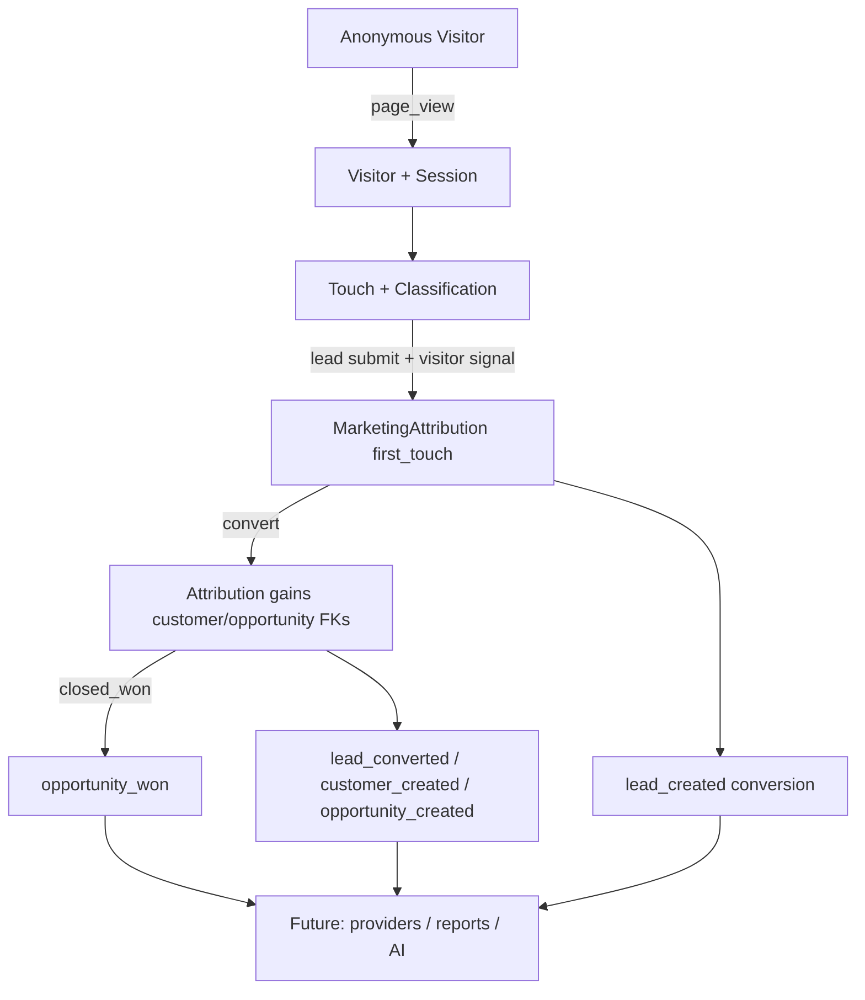

# Marketing Platform Overview

## Status

- Phase: P7B.F (Foundation Freeze)
- State: **Stable / Frozen**
- Quality gate at freeze: 542 tests, 1781 assertions, 0 failures
- Next implementation phase: **Phase 7C — Meta Business Integration**

## Purpose

The NovaCRM Marketing Platform is the **single source of truth** for anonymous traffic, channel classification, lead attribution, and conversion events.

Future consumers — Meta Business, Google Ads, LinkedIn, Marketing Reporting, Workflow Automation, and the AI Platform — must consume these contracts. They must not invent parallel attribution, conversion vocabularies, or tracking writes.

## Formal Stability Declaration

As of Phase 7B.F:

1. Service boundaries are frozen.
2. Public contracts are documented and binding.
3. Provider integrations require **no architectural changes** to the platform core — only adapters and sync persistence for provider hierarchy entities.
4. Runtime behavior of Phases 7B.1–7B.6 is unchanged by this freeze.
5. The platform is declared **stable** for external integration work.

## Frozen Contract Set

| Contract | Document |
| --- | --- |
| Runtime (visitor / session / touch / cookies) | `docs/MARKETING_RUNTIME_CONTRACT.md` |
| Channel classification | `docs/MARKETING_CHANNEL_CLASSIFICATION_CONTRACT.md` |
| Attribution semantics (architecture) | `docs/MARKETING_ATTRIBUTION_CONTRACT.md` |
| Attribution runtime (identity / first_touch) | `docs/MARKETING_ATTRIBUTION_RUNTIME_CONTRACT.md` |
| Conversion events | `docs/MARKETING_CONVERSION_CONTRACT.md` |
| Historical backfill | `docs/MARKETING_BACKFILL_CONTRACT.md` |
| Architecture TDS | `docs/P7_MARKETING_PLATFORM_TDS.md` |

## Complete Architecture

```
┌─────────────────────────────────────────────────────────────────┐
│                        Consumers (future)                        │
│  Meta │ Google Ads │ LinkedIn │ Reports │ Automation │ AI       │
└───────────────────────────────┬─────────────────────────────────┘
                                │ read / export only
┌───────────────────────────────▼─────────────────────────────────┐
│                     Marketing Platform (SoT)                     │
│                                                                  │
│  MarketingTrackingService          ← visitors, sessions, touches │
│           │                                                      │
│           ▼                                                      │
│  MarketingChannelClassificationService  ← pure classify          │
│           │                                                      │
│           ▼                                                      │
│  MarketingAttributionService       ← visitor ↔ CRM relationship  │
│           │                                                      │
│           ▼                                                      │
│  MarketingConversionService        ← immutable business events   │
│                                                                  │
│  MarketingBackfillService          ← maintenance orchestration   │
└───────────────────────────────┬─────────────────────────────────┘
                                │ additive hooks only
┌───────────────────────────────▼─────────────────────────────────┐
│  LeadService │ LeadConversionService │ OpportunityService        │
│  (existing CRM — unchanged contracts)                            │
└─────────────────────────────────────────────────────────────────┘
```

NovaCRM layering is preserved:

```
Controllers / Middleware / Artisan
        ↓
Form Requests (where applicable)
        ↓
Services (transactions, single write authorities)
        ↓
Models (BelongsToOrganization where tenant-owned)
```

Prohibited patterns remain prohibited: Repository Pattern, DDD, CQRS, Event Sourcing, Generic Base Services, Workflow Engines. Touches and conversions are append-only Eloquent tables — immutable data, not an event store.

## Service Responsibilities

| Service | Responsibility | Writes |
| --- | --- | --- |
| `MarketingTrackingService` | Visitor/session lifecycle, page-view touches, cookie-backed resolve | `marketing_visitors`, `marketing_sessions`, `marketing_touches` |
| `MarketingChannelClassificationService` | Deterministic channel/source/medium from URL + referrer | **None** (pure) |
| `MarketingAttributionService` | Identity resolution, first_touch attribution, propagation, visitor claim | `marketing_attributions` (+ visitor `organization_id` claim) |
| `MarketingConversionService` | Canonical conversion events, duplicate prevention, history | `marketing_conversions` |
| `MarketingBackfillService` | Historical matching orchestration, dry-run, cursors, replay | **None directly** — delegates to attribution + conversion |
| `OpportunityService` | Opportunity stage transitions (CRM) with conversion hook | Opportunities (+ conversion via marketing service) |

## Data Model (Implemented Foundation)

```
marketing_visitors
    └── marketing_sessions
            └── marketing_touches          (classified)
    └── marketing_attributions             (tenant-owned)
            ├── lead_id
            ├── customer_id?
            ├── opportunity_id?
            └── marketing_conversions[]    (immutable)
```

Ownership:

| Entity | Tenant column | Scope trait |
| --- | --- | --- |
| Visitor | Nullable `organization_id` | No (anonymous until claim) |
| Session / Touch | None (transitive) | No |
| Attribution | Required `organization_id` | `BelongsToOrganization` |
| Conversion | Required `organization_id` | `BelongsToOrganization` |

## Data Flow

### Live tracking

```
Browser
  → POST /marketing/track (throttled)
    → MarketingTrackingMiddleware (resolve visitor/session cookies)
    → MarketingTrackingController
      → MarketingTrackingService::recordPageView
        → MarketingChannelClassificationService::classify
        → createTouch
  ← 204 + cookies
```

### Lead attribution

```
Lead create (web cookies or API visitor_uuid)
  → LeadService
    → MarketingAttributionService::attributeLead
    → MarketingConversionService::recordLeadCreated
```

### Conversion cascade

```
LeadConversionService::convert
  → MarketingAttributionService::propagateToConversion
  → MarketingConversionService (lead_converted / customer_created / opportunity_created)

OpportunityService::updateStage → closed_won
  → MarketingConversionService::recordOpportunityWon
```

### Backfill (offline)

```
marketing:backfill-attribution
  → MarketingBackfillService
    → attribution + conversion services only
```

## Lifecycle Diagram



## Extension Points (No Core Architecture Change)

| Extension | How |
| --- | --- |
| New search/social domains | `config/marketing.php` classification registries |
| New click ID (e.g. `ttclid`) | Config + additive column + contract revision |
| New conversion event | Config + model constant + CRM hook + contract revision |
| New attribution model | Config `supported_models` + additive rows + contract revision |
| Meta / Google / LinkedIn | Provider adapter interface + sync services; consume conversions/attribution |
| Reporting | Read `marketing_conversions` ⨝ `marketing_attributions` ⨝ touches |
| Automation / AI | Same read surface; never bypass write authorities |
| Historical repair | `marketing:backfill-attribution` only |

## Future Roadmap

| Phase | Deliverable |
| --- | --- |
| **7B.F** (this) | Foundation freeze & platform contracts |
| **7C** | Meta Business Integration (adapter, OAuth, sync, webhooks) |
| **7D/7E** | Google Ads / LinkedIn (prove zero platform-core changes) |
| **7F/7G** | Marketing reports & campaign dashboard |
| **7H** | Offline conversion import + outbound provider push |
| **7I** | Public Marketing REST APIs |

Provider hierarchy entities (Account → Campaign → Ad Group → Ad → Keyword), spend snapshots, and adapter interfaces ship with the first provider phase. They plug into this foundation; they do not redefine it.

## Consumer Rules (Binding)

1. **Write through platform services only** — never direct table writes from providers or reports.
2. **Read conversions and attribution as truth** — do not re-infer lifecycle events from CRM tables.
3. **Map outbound; do not redefine inbound vocabulary** — event names and channels are platform-owned.
4. **Respect tenant isolation** — every query and job carries explicit `organization_id` where scopes are fail-open.
5. **Degrade gracefully** — missing tracking/attribution must never block CRM operations.

## What This Freeze Does Not Change

- No runtime behavior changes.
- No schema changes.
- No API changes.
- No controller or service behavior changes.
- Documentation and contract formalization only.

## Related Impact Reports

- `docs/P7_PHASE_7B1_IMPACT_REPORT.md` — Foundation
- `docs/P7_PHASE_7B2_IMPACT_REPORT.md` — Tracking Runtime
- `docs/P7_PHASE_7B3_IMPACT_REPORT.md` — Channel Classification
- `docs/P7_PHASE_7B4_IMPACT_REPORT.md` — Identity Resolution
- `docs/P7_PHASE_7B5_IMPACT_REPORT.md` — Conversion Events
- `docs/P7_PHASE_7B6_IMPACT_REPORT.md` — Historical Backfill
- `docs/P7_PHASE_7BF_IMPACT_REPORT.md` — Foundation Freeze
