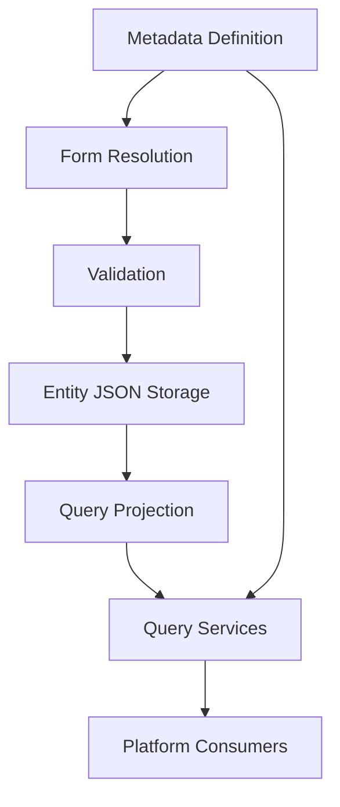
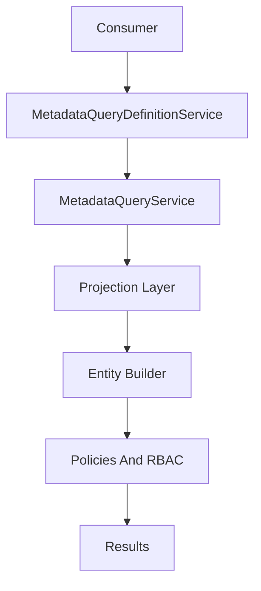
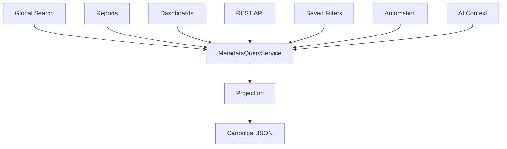

# Metadata Query Contract

## Purpose

This document is the canonical read-side contract for NovaCRM metadata values.

It defines how metadata becomes searchable, filterable, sortable, reportable, API-queryable, automation-ready, and AI-context-ready while preserving the existing metadata runtime and validation contracts.

This contract is the read-side equivalent of:

- `docs/METADATA_RUNTIME_CONTRACT.md`
- `docs/METADATA_VALIDATION_CONTRACT.md`

The metadata lifecycle is:



## Architectural Principles

- One read path: every metadata-aware consumer must query metadata through the Metadata Query Layer.
- One validation path: every metadata write must continue through `MetadataValidationService` or an approved service that delegates to it.
- One write path: every metadata write must continue through `MetadataValueStorageService`.
- JSON as canonical storage: entity `custom_fields` remains the source of truth for current metadata values.
- Projection as query infrastructure: projection rows are derived indexes, not business records.
- Laravel-native services: query behavior belongs in concrete application services, not repositories, DDD layers, CQRS handlers, event sourcing, workflow engines, generic base services, or generic query builders.
- Tenant-first design: every query, projection, rebuild, and index must be scoped by organization before entity or field.
- Capability-driven queries: metadata definitions decide whether a field may be searched, filtered, sorted, reported, exported, or exposed through APIs.
- RBAC-first access: entity policies, module permissions, metadata permissions, sensitivity rules, and API visibility rules are enforced before query execution.
- Rebuildable read model: projection data can always be deleted and regenerated from canonical JSON plus metadata definitions.
- Consumer reuse over duplication: global search, advanced filters, saved filters, reports, dashboards, REST APIs, automation, and AI retrieval must not implement independent metadata query logic.

## Official Read Pipeline

The approved metadata read pipeline is:



Stage responsibilities:

- Consumer: submits structured metadata query intent for a specific capability and entity type. Consumers do not write SQL for metadata and do not inspect `custom_fields` directly for platform queries.
- `MetadataQueryDefinitionService`: resolves active definitions for the current organization, entity type, and capability. It enforces lifecycle status and capability flags before a query can be compiled.
- `MetadataQueryService`: validates query intent against definitions, capabilities, tenant context, RBAC context, sensitivity rules, and supported operators, then compiles the query into reusable Eloquent constraints.
- Projection Layer: stores typed, tenant-scoped, rebuildable query rows derived from canonical entity JSON.
- Entity Builder: remains the normal Eloquent builder for the target entity, preserving existing controller, service, pagination, eager loading, and policy patterns.
- Policies and RBAC: enforce entity-level and capability-specific access before records are returned.
- Results: return authorized entity results, aggregates, or search matches without exposing unauthorized metadata values.

Every metadata consumer must use this read path. Direct JSON querying may exist only for internal verification, rebuild, drift detection, or migration tools.

## Query Service Responsibilities

### MetadataQueryDefinitionService

`MetadataQueryDefinitionService` resolves the metadata definitions that are eligible for a read capability.

Responsibilities:

- Resolve definitions by `organization_id`, `entity_type`, active status, and capability flag.
- Support capability contexts such as `filter`, `sort`, `search`, `report`, `api`, `export`, `automation`, and `ai_context`.
- Exclude inactive, archived, deleted, unknown, or unauthorized definitions from normal user queries.
- Exclude sensitive fields unless the calling context and user are explicitly authorized by policy.
- Return definition metadata required for query compilation, including key, type, options, sensitivity, and capability flags.
- Cache resolved definitions per request when safe.

Non-responsibilities:

- It does not validate writes.
- It does not read or write entity `custom_fields`.
- It does not update projections.
- It does not execute entity queries.

### MetadataQueryService

`MetadataQueryService` is the authoritative metadata filter and sort compiler.

Responsibilities:

- Accept structured metadata query intent.
- Validate keys, operators, values, capabilities, tenant context, and RBAC context.
- Normalize query values for comparison according to metadata field type.
- Compile metadata filters and sorts into Eloquent constraints against the projection layer.
- Return or mutate the target entity Eloquent builder in a predictable Laravel-native way.
- Preserve existing entity scopes, policies, pagination, and eager loading.

Strict boundaries:

- It never performs writes.
- It never updates projections.
- It never repairs projection drift.
- It never mutates metadata definitions.
- It never mutates entity `custom_fields`.
- It never bypasses RBAC.
- It never bypasses tenant isolation.
- It never exposes raw SQL as a consumer interface.
- It never accepts unvalidated arbitrary query fragments.

### MetadataProjectionService

`MetadataProjectionService` owns creation, synchronization, deletion, rebuild, and drift repair for projection rows.

Responsibilities:

- Read canonical metadata values from entity `custom_fields`.
- Resolve relevant metadata definitions.
- Derive typed projection rows.
- Upsert, delete, rebuild, and repair projection rows.
- Support full and partial rebuilds.
- Report projection drift and rebuild status.

Non-responsibilities:

- It does not accept user-submitted metadata as a write target.
- It does not validate metadata input.
- It does not decide whether a user may query a field.
- It does not return business results to end consumers.

### MetadataSearchService

`MetadataSearchService` coordinates metadata-aware search for global search and future search consumers.

Responsibilities:

- Accept structured search intent from approved consumers.
- Resolve searchable definitions through `MetadataQueryDefinitionService`.
- Enforce tenant context, entity permissions, search capability flags, API visibility where relevant, and sensitivity rules.
- Delegate lookup execution to the configured `MetadataSearchProvider`.
- Intersect search matches with authorized entity builders before returning results.
- Return search results in a consumer-safe shape with authorized labels, snippets, or entity references.

Non-responsibilities:

- It does not write metadata values.
- It does not update or rebuild projections.
- It does not bypass `MetadataQueryService` for filter or sort predicates.
- It does not treat external search provider results as authoritative authorization decisions.
- It does not expose sensitive metadata snippets unless explicitly authorized by future policy.

### MetadataSearchProvider

`MetadataSearchProvider` is the future boundary for metadata search acceleration.

Default provider:

- `ProjectionSearchProvider`: uses relational projection rows as the Phase 6 metadata search source.

Future providers:

- `ElasticsearchProvider`
- `OpenSearchProvider`

Provider rules:

- Relational projection remains the primary query source for Phase 6.
- Search providers may accelerate full-text lookup, relevance ranking, and fuzzy matching.
- Search providers must not become the source of truth for authorization, filtering, sorting, reporting, saved filters, automation, or AI retrieval.
- Search providers must receive only tenant-scoped and authorization-safe query input.
- Search provider results must be intersected with authorized entity queries before records are returned.

### MetadataReportQueryService

`MetadataReportQueryService` coordinates metadata-aware report filters, dimensions, and grouping rules.

Responsibilities:

- Resolve reportable definitions through `MetadataQueryDefinitionService`.
- Apply metadata report filters through `MetadataQueryService`.
- Restrict report groupings to field types with stable grouping semantics.
- Enforce tenant context, report permissions, metadata capability flags, and sensitivity rules.
- Provide report-safe display labels and option labels after authorization.

Non-responsibilities:

- It does not calculate unrelated business metrics.
- It does not write metadata values.
- It does not update or rebuild projections.
- It does not allow non-reportable fields to be used as report dimensions.
- It does not bypass reporting permissions or entity authorization.

### MetadataSavedFilterService

`MetadataSavedFilterService` owns saved metadata filter definitions when saved filters are introduced.

Responsibilities:

- Store structured query intent using field keys, operators, values, entity type, and execution context.
- Revalidate definitions, operators, permissions, sensitivity, and capability flags at execution time.
- Expand valid saved filters into `MetadataQueryService` input.
- Mark filters invalid or partially invalid when referenced fields become unavailable.
- Preserve tenant ownership of saved filter definitions.

Non-responsibilities:

- It does not store raw SQL.
- It does not query projection rows directly.
- It does not write metadata values.
- It does not update or rebuild projections.
- It does not preserve access to fields that the current user can no longer query.

## Consumer Expectations

Metadata consumers submit structured query intent and receive authorized results through existing Laravel application surfaces.

Consumers include:



Consumer rules:

- Consumers do not query `custom_fields` directly for production metadata search, filter, sort, reporting, dashboard, API, automation, or AI behavior.
- Consumers do not query projection tables directly.
- Consumers do not bypass `MetadataQueryService` for metadata predicates.
- Consumers identify fields by `MetadataFieldDefinition.key`, not label or field ID.
- Consumers must provide context so capability and security rules can be enforced.
- Saved consumers must store structured query intent, not SQL.

## Supported Capabilities

The query layer supports:

- Metadata filtering.
- Metadata sorting.
- Metadata-aware pagination stability.
- Metadata search.
- Metadata report filtering.
- Metadata report grouping where field type supports grouping.
- Dashboard filtering and aggregation support.
- REST API metadata filtering and optional metadata output.
- Saved filter validation and execution.
- Automation candidate retrieval.
- AI context retrieval.

Capability flags:

- `is_filterable` gates filters.
- `is_sortable` gates sorts.
- `is_searchable` gates metadata search.
- `is_reportable` gates report filters and report dimensions.
- `is_exportable` gates export usage.
- `is_api_visible` gates API query and output usage.
- `is_sensitive` restricts search, API, report, export, automation, and AI usage unless explicitly authorized.

## Query Request Model

Consumers pass structured intent. The exact PHP DTO or request object may be defined during implementation, but the logical model is:

```json
{
  "organization_id": 123,
  "entity_type": "lead",
  "context": "web_index",
  "filters": [
    {
      "key": "visa_type",
      "operator": "equals",
      "value": "student"
    }
  ],
  "sort": {
    "key": "ielts_score",
    "direction": "desc"
  },
  "search": {
    "term": "canada",
    "mode": "contains"
  },
  "pagination": {
    "page": 1,
    "per_page": 15
  }
}
```

Rules:

- `organization_id` comes from `TenantContext` or an explicitly trusted service context.
- `entity_type` must be one of the metadata-enabled entity types.
- `context` must identify the consuming surface.
- `filters` must reference active authorized definitions.
- `sort` must reference one active authorized sortable definition.
- `search` must use searchable definitions only.
- Pagination limits are enforced by the consuming web or API surface.

## Query Response Guarantees

The query layer guarantees:

- Results are tenant-scoped.
- Results respect entity authorization.
- Results respect metadata capability flags.
- Results do not include unauthorized sensitive metadata.
- Metadata sorting is deterministic by adding an entity primary-key tie breaker.
- Projection-backed filters use typed comparisons where field type supports them.
- Empty metadata values follow the runtime contract: missing keys and cleared values are represented by absent projection rows unless a field-specific projection rule defines otherwise.
- `is_empty` and `is_not_empty` operators must distinguish absent values from stored falsey values such as boolean `false`, numeric `0`, and string `"0"`.
- Pagination is applied to the authorized entity builder after metadata predicates are compiled.
- Paginated results remain stable when metadata sorting adds a deterministic entity primary-key tie breaker.
- Unknown, inactive, archived, deleted, or unauthorized fields are rejected or ignored according to the consumer contract.
- Saved filters are revalidated at execution time against current definitions and user permissions.

The query layer does not guarantee:

- That projection data is canonical business data.
- That external search provider results are immediately consistent.
- That unsupported operators will be emulated with slow JSON scans.
- That consumers can query fields by label.

## Projection Ownership

Entity JSON remains the canonical source of truth.

Projection rows:

- Are derived query indexes.
- Are rebuildable from canonical `custom_fields` and metadata definitions.
- Contain no independent business state.
- Must never be treated as user-editable metadata values.
- Must never be the source for metadata writes.
- May be deleted and regenerated safely.
- May lag behind canonical JSON if asynchronous projection is enabled.
- Must be repairable through idempotent rebuild tooling.

If projection and entity JSON disagree, entity JSON wins.

## Projection Lifecycle

Initial Projection:

- Existing entity JSON is scanned in organization and entity-type chunks.
- Projection rows are generated from canonical values and active/relevant definitions.
- Backfill is idempotent and restartable.

Incremental Synchronization:

- After successful entity metadata persistence, the entity is synchronized into projection.
- Synchronization reads the saved entity JSON rather than trusting raw request input.
- Sync may be synchronous initially or queued after commit when scale requires it.

Reprojection After Updates:

- Changed values upsert corresponding projection rows.
- Cleared values delete projection rows for that entity and key.
- Omitted values do not trigger projection changes unless the entity is rebuilt.

Definition Changes:

- Capability flag changes affect query eligibility immediately.
- Label changes do not require projection rebuild because field keys remain stable.
- Option label changes do not require value projection rebuild, but display caches may need refresh.
- Type changes after publication should remain constrained by metadata identity rules. If an administrative type correction is allowed, it requires field-level reprojection.
- Deactivation removes fields from query availability immediately; projection rows may remain for historical rebuild or audit diagnostics.

Full Rebuild:

- Projection can be rebuilt for one entity, one field definition, one organization/entity type, or the entire system.
- Full rebuilds delete and regenerate projection rows from canonical JSON.
- Rebuild jobs are chunked, idempotent, restartable, and tenant-scoped.

Drift Detection:

- Drift detection compares entity JSON against projection rows.
- Drift reports missing rows, stale rows, extra rows, wrong typed values, and invalid field references.
- Drift detection does not alter business data.

Recovery:

- Recovery deletes incorrect projection rows and regenerates them from canonical JSON.
- Recovery is safe because projection contains no independent business state.
- Failed jobs can be retried without duplicating logical rows.

Archival Behaviour:

- Soft-deleted entities are excluded through the entity builder and may have projection rows retained or purged according to operational policy.
- Archived metadata definitions are excluded from normal query compilation.
- Historical projection rows must not make archived fields queryable unless an explicit administrative historical reporting mode is designed later.

## Tenant Isolation Guarantees

Every projection row must include `organization_id`.

Every metadata query must include:

- `organization_id`
- `entity_type`
- `field_key` or definition identity
- the target entity table constraint

Rules:

- Projection joins must never use `entity_id` alone.
- Query indexes must be organization-first.
- Tenant context must be resolved before metadata query compilation.
- Platform cross-tenant reads must use explicit platform services and must not reuse tenant-scoped query paths casually.
- Tests must prove that a matching projection row from another tenant cannot affect results.

## Security And RBAC Rules

Entity authorization:

- Entity policies and module permissions remain the first gate.
- Users must be authorized to view the target entity type before metadata filters are compiled.

Metadata authorization:

- Capability flags are mandatory gates.
- Sensitive fields are excluded by default from search, API output, exports, reports, saved filter display, automation, and AI context.
- Future field-level permissions must be enforced by `MetadataQueryDefinitionService` before fields become queryable.
- API metadata filtering and output require `is_api_visible`.
- Reporting requires `is_reportable`.
- Export requires `is_exportable`.

Saved filters:

- Store field keys, operators, values, and context.
- Do not store SQL.
- Revalidate definitions, permissions, sensitivity, and capability flags at execution time.
- Become partially invalid or disabled if referenced fields are no longer available.

AI context:

- Uses the same metadata query path as user-facing consumers.
- Receives only authorized fields.
- Sensitive values are excluded unless a future explicit sensitive-access policy allows them.
- Must not bypass tenant or RBAC constraints for retrieval convenience.

## Performance Expectations

Phase 6 must be designed for:

- Millions of records.
- Hundreds of metadata fields per tenant.
- Thousands of tenants.
- Common metadata filters and sorts within normal web latency budgets.
- Rebuilds that can run safely while the application remains online.

Performance rules:

- Use typed projection columns for indexable comparisons.
- Keep indexes tenant-first.
- Do not perform broad JSON scans for normal metadata queries.
- Do not create per-tenant or per-field schema changes as the default indexing strategy.
- Limit expensive text `contains` behavior and reserve advanced full-text use cases for search providers.
- Add deterministic tie breakers for metadata sorts.
- Cache resolved query definitions per request when appropriate.
- Monitor slow metadata queries, projection lag, rebuild throughput, and drift counts.

## Extension Rules

New consumers must:

- Use `MetadataQueryService` for metadata predicates.
- Use `MetadataQueryDefinitionService` for available fields and capabilities.
- Use `MetadataProjectionService` only for projection maintenance, not user querying.
- Use structured query intent.
- Respect capability flags and security rules.
- Preserve canonical JSON as the business source of truth.

New field types must define:

- Projection storage shape.
- Supported operators.
- Sorting behavior.
- Search behavior.
- Report behavior.
- Empty/null behavior.
- Sensitivity behavior.
- Rebuild behavior.

New search providers must:

- Implement the `MetadataSearchProvider` boundary.
- Preserve authorization and tenant guarantees.
- Be optional accelerators, not required for core filtering or reporting.
- Support fallback to relational projection.

## Explicit Non-Goals

The Metadata Query Layer does not:

- Replace `MetadataFormResolver`.
- Replace `MetadataValidationService`.
- Replace `MetadataValueStorageService`.
- Redesign entity `custom_fields` JSON.
- Validate writes.
- Normalize writes.
- Persist user-submitted metadata values.
- Create a second write path.
- Use projection rows as canonical business data.
- Introduce repositories, DDD, CQRS, event sourcing, workflow engines, generic base services, or generic query builders.
- Guarantee external search engine consistency.
- Support arbitrary SQL or arbitrary nested query logic in Phase 6.
- Make archived or inactive fields queryable by default.
- Bypass tenant isolation, policies, permissions, or sensitivity rules.
