# Phase 10 — Enterprise HRMS Platform: Complete Phase Development Guide

**Project:** NovaCRM  
**Platform:** Human Resource Management System (HRMS)  
**Last updated:** 2026-07-20

---

## 1. Overview

Phase 10 introduces a production-grade HRMS as a **first-class platform** inside NovaCRM. The HRMS manages the employee lifecycle — from hire to exit — including organization structure, profiles, documents, attendance, leave, and employee self-service.

It is built **additively** on top of existing NovaCRM platforms:

| Platform | HRMS use |
| --- | --- |
| RBAC | `hrms.*`, `attendance.*`, `leave.*`, `ess.access` permissions |
| Audit | `Auditable` trait + `AuditLogger` on all HR writes |
| Workflow | Domain events only; no HR business logic inside Workflow |
| Notifications | Leave/attendance/onboarding reminders via `NotificationService` |
| Multi-tenancy | `organization_id` + `BelongsToOrganization` on every table |

**Canonical write path:**

```text
Controllers → Form Requests → Hrms*Service → Models (organization_id)
```

**Explicitly excluded from all Phase 10 work:**

- Repository pattern, DDD, CQRS, event sourcing, generic base services
- Mobile apps, biometrics, geo-fencing, face recognition
- Payroll compliance (Phase 10.3), recruitment (Phase 11), performance (Phase 10.4)

---

## 2. Phase Roadmap

```mermaid
flowchart LR
  subgraph p101 [Phase 10.1 Core HR MVP]
    A[10.1.1 Foundation]
    B[10.1.2 Employee and Org]
    C[10.1.3 Documents]
    D[10.1.4 Attendance]
    E[10.1.5 Leave]
    F[10.1.6 ESS and Dashboards]
    A --> B --> C --> D --> E --> F
  end
  subgraph p102 [Phase 10.2 HR Ops]
    G[Expenses Announcements Assets Exit]
  end
  subgraph p103 [Phase 10.3 Payroll]
    H[Salary Payslips India Compliance]
  end
  subgraph p104 [Phase 10.4 Performance]
    I[KPI KRA Reviews 360 Feedback]
  end
  subgraph p11 [Phase 11 Talent]
    J[ATS Recruitment Offers]
  end
  subgraph p115 [Phase 11.5 Engagement]
    K[Training Recognition Surveys]
  end
  F --> G --> H --> I --> J --> K
```



---

## 3. Phase 10.1 — Core HR Foundation (MVP)

**Objective:** Deliver a usable HRMS covering employee master data, org structure, documents, attendance, leave, ESS, and role-specific dashboards.

### 3.1 Phase 10.1.1 — HRMS Foundation ✅ Complete

**Status:** Done (2026-07-20)

Establishes infrastructure only — no employee-facing business logic.

| Deliverable | Description |
| --- | --- |
| `config/hrms.php` | Catalogs: employment statuses/types, attendance/leave statuses, document categories, shift presets, probation defaults, workflow trigger placeholders |
| Database schema | 22 tables: org structure, employees, profile, documents, attendance, leave, announcements |
| Eloquent models | All tables modeled with tenancy + audit + relationships |
| Factories | Employee, Branch, Department, Designation, Team, Shift, LeaveType, Holiday |
| Service skeletons | `app/Services/Hrms/*` (constructor injection only) |
| RBAC | 14 permissions across `hrms`, `attendance`, `leave`, `ess` modules |
| Policies | 8 policies registered in `AppServiceProvider` |
| Navigation | HR sidebar (`hrms.view`) + Self-Service sidebar (`ess.access`) |
| Placeholder UI | `/hrms` and `/ess` dashboard pages |
| Tests | `HrmsFoundationTest` — 11 tests, MySQL verified |
| Docs | `HRMS_PLATFORM_RUNTIME_CONTRACT.md`, `P10_PHASE_10_1_FOUNDATION_PROGRESS.md` |

**Key files:**

- Migrations: `2026_07_20_000001_create_hrms_foundation_tables.php`, `2026_07_20_000002_sync_hrms_permissions.php`
- Tests run against isolated DB: `novacrm_testing` (see `phpunit.xml`)

---

### 3.2 Phase 10.1.2 — Employee & Organization Structure

**Status:** In progress

| Feature | Scope |
| --- | --- |
| Branches | CRUD for `hrms_branches` |
| Departments | CRUD + hierarchy (`parent_id`) |
| Designations | CRUD + level ordering |
| Teams | CRUD linked to departments |
| Employee master | Create/update/exit, auto `employee_code`, optional `user_id` link |
| Profile sections | Emergency contacts, bank accounts, identities, education, experience |
| Reporting hierarchy | `reporting_manager_id` self-FK management |

**Services to implement:** `BranchService`, `DepartmentService`, `DesignationService`, `TeamService`, `EmployeeService`

**UI:** `/hrms/employees`, `/hrms/organization/*` resource pages

**Events:** `employee.created`, `employee.updated`, `employee.exited`, `employee.manager_changed`, `employee.department_changed`

---

### 3.3 Phase 10.1.3 — Employee Documents

**Status:** Pending

| Feature | Scope |
| --- | --- |
| Upload | Secure file storage (reuse `AttachmentService` patterns) |
| Categorization | From `config/hrms.php` document categories |
| Versioning | `employee_document_versions` with version numbers |
| Expiry tracking | `expires_at` + future reminder trigger |
| Verification | `verification_status`: pending / verified / rejected |
| Download | Authorized download via policy + service |

**Service:** `EmployeeDocumentService`

**Permission:** `hrms.documents.manage`

---

### 3.4 Phase 10.1.4 — Attendance Management

**Status:** Pending

| Feature | Scope |
| --- | --- |
| Shifts | CRUD from shift presets in config |
| Shift assignment | `employee_shift_assignments` with effective dates |
| Clock in / out | Manual clock via `AttendanceService` |
| Daily records | Status, late/early/OT minutes calculated from shift |
| Corrections | Employee submits; manager/HR approves via `attendance_corrections` |

**Statuses:** From `config/hrms.php` → `attendance_statuses`

**Permissions:** `attendance.view`, `attendance.manage`, `attendance.correct`

**Future integrations (out of scope):** Biometrics, mobile, geo-fencing

---

### 3.5 Phase 10.1.5 — Leave Management

**Status:** Pending

| Feature | Scope |
| --- | --- |
| Leave types | CRUD; seed defaults from `config/hrms.php` |
| Holiday calendar | `holidays` per organization |
| Leave balances | Annual entitlement per employee/type/year |
| Applications | Apply, half-day support, cancel |
| Approval flow | Relational `leave_approval_steps` (not JSON chains) |
| Approval levels | Reporting manager → optional HR (if `requires_hr_approval` on leave type) |

**Approval ownership:** State machine lives entirely in `LeaveService`. Workflow receives events only.

**Workflow events:** `leave.submitted`, `leave.approved`, `leave.rejected`, `leave.cancelled`

**Permissions:** `leave.view`, `leave.manage`, `leave.approve`

---

### 3.6 Phase 10.1.6 — ESS Portal & Dashboards

**Status:** Pending

#### Employee Self-Service (`/ess`)

| Feature | Scope |
| --- | --- |
| Profile view | Read own employee record |
| Permitted updates | Configurable self-edit fields |
| Documents | View/download own documents |
| Attendance | Today's record + history |
| Leave | Balance view + apply + history |
| Announcements | Read `hrms_announcements` |

**Context:** `EssContext::employeeFor()` resolves User → Employee within tenant.

#### Dashboards

| Dashboard | Audience | Widgets |
| --- | --- | --- |
| HR Dashboard | `hrms.view` | Employee count, attendance summary, leave summary, new joiners, birthdays, anniversaries |
| Manager Dashboard | `leave.approve` / manager role | Team attendance, pending approvals, team leave calendar |
| ESS Dashboard | `ess.access` | Today's attendance, leave balance, upcoming holidays |

**Service:** `HrmsDashboardService`

---

### Phase 10.1 Acceptance Criteria

Phase 10.1 is complete when:

- [ ] Employee CRUD + org structure + profile editing works
- [ ] Document upload, versioning, expiry, secure download works
- [ ] Attendance clock in/out, corrections, shift assignment works
- [ ] Leave apply → multi-level approve → balance deduction works
- [ ] ESS portal shows only the logged-in employee's data
- [ ] HR / manager / employee dashboards show real widgets
- [ ] RBAC enforced on all routes and policies
- [ ] Workflow events registered and listeners fire correctly
- [ ] Audit logging on all writes
- [ ] Multi-tenancy verified (cross-org isolation tests)
- [ ] Full regression suite passes on MySQL
- [ ] Documentation updated (`P10_PHASE_10_1_IMPACT_REPORT.md`)

---

## 4. Phase 10.2 — HR Operations

**Status:** Not started

| Module | Description |
| --- | --- |
| Expense claims | Submit, approve, reimburse via Workflow |
| Company announcements | Full bulletin board (extends `hrms_announcements`) |
| Employee assets | Asset assignment and return tracking |
| Exit clearance | Structured offboarding checklist |
| Incident / grievance | Case management with approval flows |

All approval flows reuse the Workflow Platform; business logic stays in HRMS services.

---

## 5. Phase 10.3 — Payroll

**Status:** ✅ Complete (10.3.1–10.3.5) — Payroll platform complete

| Module | Description | Status |
| --- | --- | --- |
| Salary structures | Earnings and deductions templates | ✅ 10.3.1 |
| Salary components | Component catalog with metadata | ✅ 10.3.1 |
| Employee salary assignment | Historical assignments with effective dating | ✅ 10.3.1 |
| Payroll periods | Monthly periods with draft/open/locked/processed | ✅ 10.3.1 |
| Payroll configuration | Org-level frequency, currency, rounding | ✅ 10.3.1 |
| Payroll calculation contracts | Read-only context resolution | ✅ 10.3.1 |
| Payroll runs & results | Deterministic calculation + snapshots | ✅ 10.3.2 |
| Payroll preview / validation / recalculation | Shared engine, immutable completed runs | ✅ 10.3.2 |
| Statutory profiles & rule packs | Versioned org rule sets + employee profiles | ✅ 10.3.3 |
| PF / ESI / Professional Tax engines | Configuration-driven statutory components | ✅ 10.3.3 |
| TDS preparation | Regime/PAN/taxable snapshot (calculation deferred) | ✅ 10.3.3 |
| Compliance validation | Missing PAN/UAN/ESI/profile/rule set | ✅ 10.3.3 |
| Payroll approval & publication | State machine, locking, distribution | ✅ 10.3.4 |
| Payslip generation + PDF | Immutable payslips with stored PDF | ✅ 10.3.4 |
| ESS payroll portal | Employee history, detail, download | ✅ 10.3.4 |
| Email distribution | Queued payslip email + resend | ✅ 10.3.4 |
| Payroll ledger & journals | Immutable ledger + balanced journals | ✅ 10.3.5 |
| Bank payment exports | CSV/XLSX salary payment files | ✅ 10.3.5 |
| Employee loans & advances | Disbursement, recovery, early closure | ✅ 10.3.5 |
| Expense reimbursements | Claims, approval, payroll inclusion | ✅ 10.3.5 |
| Full & final settlement | Exit settlement statement | ✅ 10.3.5 |
| Payroll reversal | Controlled reversing entries | ✅ 10.3.5 |
| Financial reports | Summary, statutory, register, department, ledger | ✅ 10.3.5 |
| Government filing / challans / Form 16 | Portal integrations | Deferred |
| Income tax computation | Full TDS engine | Deferred |
| ERP / live banking APIs | Enterprise connectors | Deferred |

See `docs/P10_PHASE_10_3_1_PROGRESS.md` through `docs/P10_PHASE_10_3_5_PROGRESS.md`.

---

## 6. Phase 10.4 — Performance Management

**Status:** In progress — 10.4.1 Foundation, 10.4.2 Goal & KPI Management, and 10.4.3 Review Engine complete. Calibration / 360° / promotions remain later.

| Module | Description |
| --- | --- |
| KPI / KRA | Goal definition per role |
| Goal tracking | Progress updates and milestones |
| Performance reviews | Self, manager, and 360° feedback cycles |
| Promotion recommendations | Manager-initiated promotion workflow |

---

## 7. Phase 11 — Recruitment & Talent (ATS)

**Status:** Not started

| Module | Description |
| --- | --- |
| Vacancy management | Job openings with approval workflow |
| Applicant tracking | Pipeline stages, scorecards |
| Talent pool | Candidate database |
| Offer management | Offer letter generation and acceptance |

---

## 8. Phase 11.5 — Learning & Engagement

**Status:** Not started

| Module | Description |
| --- | --- |
| Training management | Courses, training matrix |
| Employee recognition | Peer and manager recognition |
| Pulse surveys | Anonymous feedback collection |
| Employee rewards | Points and redemption |

---

## 9. Platform Integration Rules

### 9.1 RBAC

Permissions follow `{module}.{action}` convention:

```text
hrms.view | hrms.create | hrms.update | hrms.manage | hrms.documents.manage
attendance.view | attendance.manage | attendance.correct
leave.view | leave.manage | leave.approve
payroll.view | payroll.manage | payroll.configuration | payroll.calculate
ess.access
```

Default role grants:

| Role | HRMS access |
| --- | --- |
| `organization-owner` | All (`*`) |
| `hr` | Full HRMS + Payroll (incl. calculate) + ESS |
| `manager` | View HRMS, attendance view/correct, leave view/approve, ESS |
| `employee` | ESS only |

### 9.2 Workflow Platform

HRMS services emit `WorkflowDomainEvent` subclasses **after successful writes**.

Workflow handlers call existing services — they never contain HR business rules.

Placeholder triggers (in `config/hrms.php`, not yet registered):

- `employee.created`, `employee.exited`, `employee.probation_ending`
- `leave.submitted`, `leave.approved`, `leave.rejected`, `leave.cancelled`
- `attendance.correction_submitted`
- `employee_document.expiring`

### 9.3 Audit Logging

All HRMS models use the `Auditable` trait. Non-CRUD actions (approve, reject, link user) use explicit `AuditLogger::log()` calls.

### 9.4 Assignment Platform

No changes in Phase 10.1. Future enhancement: `EligibleMemberResolver` will consider leave status, shift timing, and employee availability. Existing assignment strategies remain unchanged.

### 9.5 Employee Identity Model

```text
users (auth)          employees (HR master)
     │                      │
     └──── user_id ─────────┘  (nullable, unique per org)
```

- Employee record can exist without a login User.
- Linking `user_id` enables ESS portal access.
- `EssContext` resolves the current employee for authenticated requests.

---

## 10. Data Model Summary

All tables are organization-scoped (`organization_id`). Prefix `hrms_` where names could collide with CRM concepts.

| Area | Tables |
| --- | --- |
| Org structure | `hrms_branches`, `hrms_departments`, `hrms_designations`, `hrms_teams` |
| Employee | `employees` |
| Profile | `employee_emergency_contacts`, `employee_bank_accounts`, `employee_identities`, `employee_educations`, `employee_experiences` |
| Documents | `employee_documents`, `employee_document_versions` |
| Attendance | `hrms_shifts`, `employee_shift_assignments`, `attendance_records`, `attendance_corrections` |
| Leave | `leave_types`, `holidays`, `leave_balances`, `leave_applications`, `leave_approval_steps` |
| ESS | `hrms_announcements` |

Configuration catalogs live in [`config/hrms.php`](../config/hrms.php) — never hardcode status/type values in application code.

---

## 11. Implementation Sequence (Remaining 10.1 Work)

```text
10.1.1 Foundation          ✅ Done
        ↓
10.1.2 Employee + Org      → Services, CRUD UI, Form Requests, tests
        ↓
10.1.3 Documents           → Upload/version/expiry/download + authz tests
        ↓
10.1.4 Attendance          → Shifts, clock in/out, corrections, OT calc
        ↓
10.1.5 Leave               → Types, balances, apply/approve + workflow events
        ↓
10.1.6 ESS + Dashboards    → Portal pages + HR/manager/employee widgets
        ↓
10.1 Impact Report         → Full acceptance verification + regression
```

Each sub-phase must:

1. Implement service write methods (controllers stay thin)
2. Add Form Request validation against `config/hrms.php` catalogs
3. Add Feature tests (tenant isolation, RBAC, happy path)
4. Update sidebar routes as features become available
5. Pass full PHPUnit suite on MySQL (`novacrm_testing`)

---

## 12. Testing Strategy

| Layer | Approach |
| --- | --- |
| Unit | Minimal — business logic lives in services tested via Feature tests |
| Feature | `RefreshDatabase` on `novacrm_testing` (isolated from dev DB) |
| Tenant isolation | Cross-org records must return 404 or empty |
| RBAC | Test HR, manager, employee, and unauthorized roles |
| Regression | Full suite must pass before each sub-phase is marked complete |

**Commands:**

```bash
# Reset test database
php scripts/reset_test_db.php

# HRMS foundation tests
php artisan test --filter=HrmsFoundationTest

# Full regression
php artisan test

# Apply migrations to dev DB
php artisan migrate
```

---

## 13. Documentation Index

| Document | Purpose |
| --- | --- |
| [`P10_HRMS_PHASE_DEVELOPMENT.md`](P10_HRMS_PHASE_DEVELOPMENT.md) | This file — complete phase roadmap |
| [`HRMS_PLATFORM_RUNTIME_CONTRACT.md`](HRMS_PLATFORM_RUNTIME_CONTRACT.md) | Architecture boundaries and integration rules |
| [`P10_PHASE_10_1_FOUNDATION_PROGRESS.md`](P10_PHASE_10_1_FOUNDATION_PROGRESS.md) | Phase 10.1.1 completion evidence |
| `P10_PHASE_10_1_IMPACT_REPORT.md` | *(Pending)* Full Phase 10.1 acceptance report |

---

## 14. Current Status Summary

| Phase | Status |
| --- | --- |
| 10.1.1 Foundation | ✅ Complete |
| 10.1.2 Employee & Org | 🟨 In progress |
| 10.1.3 Documents | ⬜ Pending |
| 10.1.4 Attendance | ⬜ Pending |
| 10.1.5 Leave | ⬜ Pending |
| 10.1.6 ESS & Dashboards | ⬜ Pending |
| 10.2 HR Operations | ⬜ Not started |
| 10.3 Payroll | ✅ Complete (10.3.1–10.3.5 financial integration) |
| 10.4 Performance | ✅ 10.4.1 Foundation + 10.4.2 Goal & KPI Management + 10.4.3 Review Engine complete |
| 11 Recruitment | ⬜ Not started |
| 11.5 Learning & Engagement | ⬜ Not started |

**Next step:** Phase 10.1.2 — Employee master CRUD and organization structure management.
