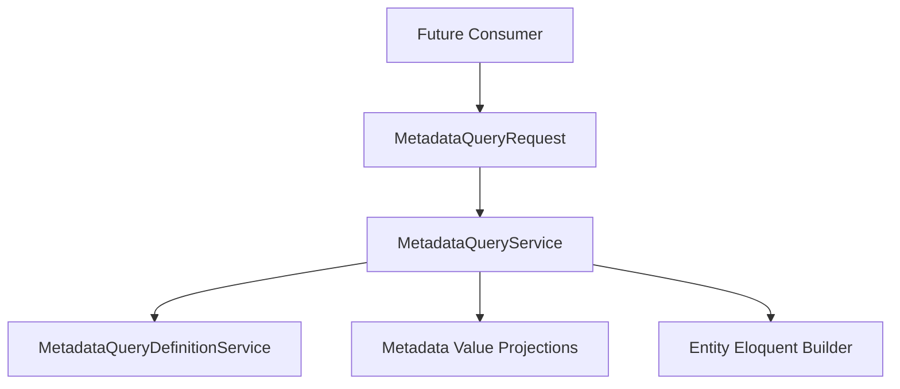
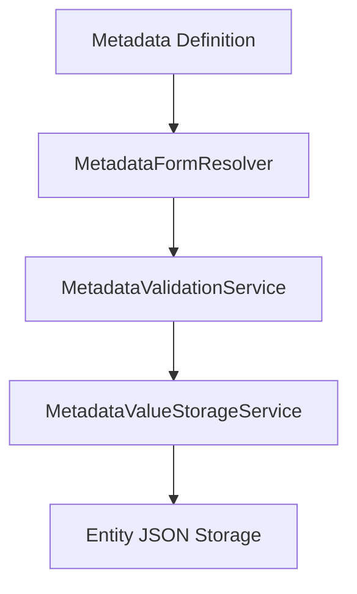

# P3 Metadata Phase 6B Impact Report

## Summary

Phase 6B introduces the Metadata Query Compiler infrastructure.

The compiler is the reusable read engine that future platform capabilities will consume for metadata-aware filtering, sorting, and capability validation. It is infrastructure only and does not integrate with UI, global search, reports, dashboards, REST APIs, automation, or AI retrieval.

## Objectives Completed

- Added structured metadata query request objects.
- Added active metadata definition resolution for query capabilities.
- Added request-lifecycle definition caching.
- Added projection-backed metadata filter compilation.
- Added metadata sorting with deterministic secondary ordering.
- Added tenant isolation at the entity and projection query boundaries.
- Added capability enforcement for filtering, sorting, search validation, report context validation, and API context validation.
- Added comprehensive Phase 6B tests for operators, validation, tenant isolation, sorting, and builder reuse.

## Files Added

- `app/Data/MetadataQueryFilter.php`
- `app/Data/MetadataQueryRequest.php`
- `app/Data/MetadataQuerySort.php`
- `app/Services/MetadataQueryDefinitionService.php`
- `app/Services/MetadataQueryService.php`
- `tests/Feature/MetadataQueryServiceTest.php`
- `docs/P3_METADATA_PHASE_6B_IMPACT_REPORT.md`

## Files Modified

No existing runtime, validation, query contract, controller, UI, API, report, dashboard, search, automation, or AI integration files were modified for Phase 6B.

## Architecture Impact

Phase 6B adds the official metadata query compiler layer described by the Query Contract.

The read-side architecture now has:

Important boundaries:

- `MetadataQueryDefinitionService` resolves definitions only. It never queries projection rows.
- `MetadataQueryService` compiles read constraints only. It never writes, updates projections, rebuilds projections, repairs drift, mutates metadata, bypasses policies, or bypasses tenant isolation.
- Future consumers must pass structured request objects instead of raw SQL or controller-specific arrays.
- Existing runtime and validation services remain unchanged.

## Runtime Impact

There is no change to metadata write behavior.

The frozen runtime pipeline remains:

Phase 6B does not alter form resolution, validation, storage normalization, entity JSON shape, clear semantics, unknown-key behavior, or projection synchronization.

## Database Impact

Phase 6B adds no migrations and no schema changes.

The compiler reads the Phase 6A `metadata_value_projections` table through projection-backed `where exists` constraints and sorting joins. Every projection predicate includes:

- `organization_id`
- `entity_type`
- `field_key`
- `entity_id` correlation with the target entity table

## Supported Operator Coverage

Text-like fields:

- `equals`
- `not_equals`
- `contains`
- `not_contains`
- `starts_with`
- `ends_with`
- `empty`
- `not_empty`

Numeric fields:

- `equals`
- `not_equals`
- `greater_than`
- `greater_than_or_equal`
- `less_than`
- `less_than_or_equal`
- `between`

Temporal fields:

- `equals`
- `before`
- `after`
- `between`

Boolean fields:

- `true`
- `false`
- `empty`
- `not_empty`

Select/radio fields:

- `equals`
- `not_equals`
- `in`
- `not_in`

Multi-select fields:

- `contains_any`
- `contains_all`
- `contains_none`
- `empty`
- `not_empty`

Compatibility aliases are accepted for contract terminology such as `is_empty`, `is_not_empty`, `gt`, `gte`, `lt`, `lte`, `is_true`, and `is_false`.

## Capability Enforcement

The compiler enforces:

- `is_filterable` for filters.
- `is_sortable` for sorting.
- `is_searchable` when search validation keys are supplied.
- `is_reportable` when the execution context is `report`.
- `is_api_visible` when the execution context is `api`.

Unsupported operators, unknown keys, inactive definitions, non-filterable fields, non-sortable fields, non-searchable search keys, non-reportable report fields, and non-API-visible API fields are rejected before query execution.

## Performance Considerations

- Definition lookups are cached within the service instance for the request lifecycle.
- Multiple filters on the same organization/entity type reuse the active definition lookup.
- Filters compile into projection-backed `where exists` predicates.
- Sorting uses a left join to one scalar projection row and adds deterministic entity primary-key ordering.
- No projection rebuild or synchronization occurs during query compilation.
- Tests assert cached definition lookup behavior for multi-filter compilation.

Future phases may add query plan analysis or database-specific `EXPLAIN` checks when consumer workloads are introduced.

## Rollback Strategy

Phase 6B is additive.

Rollback options:

- Stop resolving or injecting `MetadataQueryService` in future consumers.
- Remove the added query DTOs and query services.
- Remove `MetadataQueryServiceTest`.

No business data or projection data is changed by the compiler. Existing metadata runtime, validation, storage, and projection synchronization remain functional without Phase 6B consumers.

## Testing Summary

Targeted Phase 6B tests:

- `php artisan test --filter=MetadataQueryServiceTest`

Covered:

- Definition resolution.
- Capability resolution.
- Inactive definition exclusion.
- Definition caching.
- Text operators.
- Numeric operators.
- Date operators.
- Boolean operators.
- Select operators.
- Multi-select operators.
- Empty and not-empty semantics for falsey values.
- Unsupported operator rejection.
- Unknown key rejection.
- Inactive field rejection.
- Capability rejection.
- Tenant isolation.
- Deterministic metadata sorting.
- Null-last metadata sorting.
- Reusable Eloquent builder return behavior.
- Cached definition lookup during compilation.

## Implementation Notes

- Phase 6B intentionally does not modify any controllers.
- Phase 6B intentionally does not modify `SearchService`, report services, dashboard services, REST API resources/controllers, automation, or AI retrieval code.
- Phase 6B intentionally does not modify `METADATA_RUNTIME_CONTRACT.md`, `METADATA_VALIDATION_CONTRACT.md`, or `METADATA_QUERY_CONTRACT.md`.
- Consumer integrations are deferred to Phase 6C and later.
