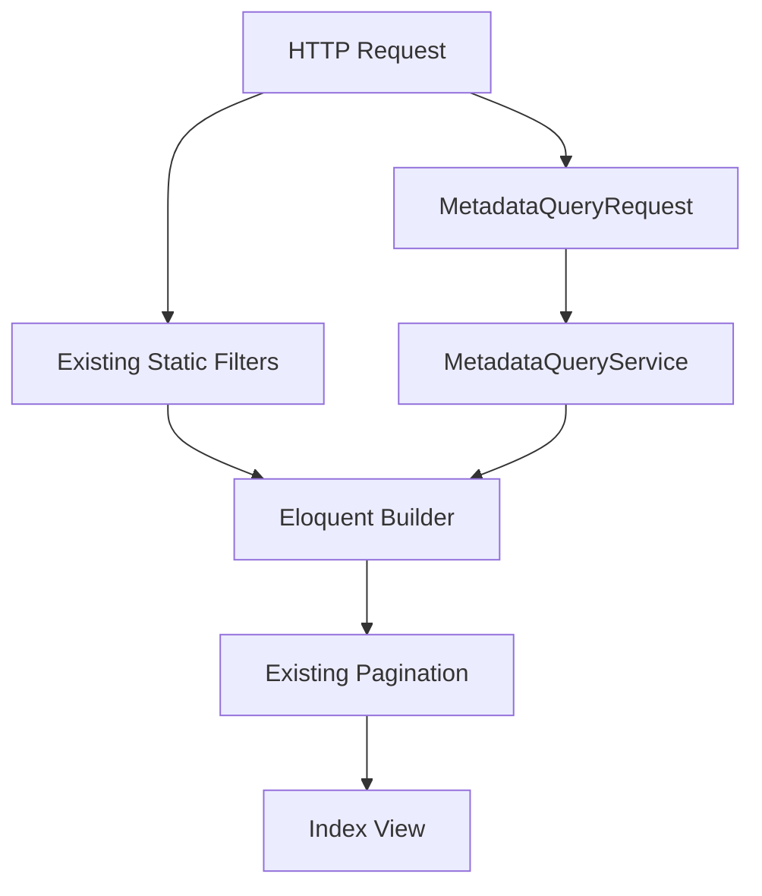

# P3 Metadata Phase 6C Impact Report

## Objectives Completed

- Integrated metadata filtering into the Leads, Customers, and Opportunities tenant index pages.
- Integrated metadata sorting into the Leads, Customers, and Opportunities tenant index pages.
- Preserved existing static filters, eager loading, policies, and pagination.
- Reused `MetadataQueryRequest`, `MetadataQueryDefinitionService`, and `MetadataQueryService`.
- Kept metadata SQL, projection joins, and value normalization out of controllers.
- Added web-index request normalization for structured metadata filter and sort input.
- Added shared index filter UI controls for metadata fields.
- Added feature coverage for metadata filtering, sorting, static filter composition, permissions, tenant isolation, pagination, security, and projection-backed query execution.

## Files Added

- `resources/views/metadata-fields/_index_query_controls.blade.php`
- `tests/Feature/MetadataIndexIntegrationTest.php`
- `docs/P3_METADATA_PHASE_6C_IMPACT_REPORT.md`

## Files Modified

- `app/Http/Controllers/LeadController.php`
- `app/Http/Controllers/CustomerController.php`
- `app/Http/Controllers/OpportunityController.php`
- `app/Services/MetadataQueryDefinitionService.php`
- `app/Services/MetadataQueryService.php`
- `resources/views/leads/index.blade.php`
- `resources/views/customers/index.blade.php`
- `resources/views/pipeline/index.blade.php`

## Architectural Impact

Phase 6C begins consumer adoption of the frozen Metadata Query Platform.

The tenant listing flow is now:



Controllers still own request collection and static entity filters. Metadata behavior remains delegated to the existing query services.

No contract files were modified:

- `docs/METADATA_RUNTIME_CONTRACT.md`
- `docs/METADATA_VALIDATION_CONTRACT.md`
- `docs/METADATA_QUERY_CONTRACT.md`

## Runtime Impact

- No metadata write path changed.
- No projection synchronization behavior changed.
- No entity JSON storage behavior changed.
- No REST API, global search, report, dashboard, saved filter, automation, or AI behavior changed.
- Web index metadata query errors are returned as validation errors instead of unhandled exceptions.

## UI Integration Impact

- Lead, Customer, and Pipeline index filters now show metadata filter and sort controls when active, non-sensitive query-capable fields exist.
- Static filters remain in their existing positions and continue to submit through the same GET forms.
- Metadata filter input is submitted as structured `metadata_filters`.
- Metadata sort input is submitted as structured `metadata_sort`.

## Security Considerations

- Entity policies continue to gate index access before records are returned.
- Tenant context is passed into `MetadataQueryRequest` and enforced again by `MetadataQueryService`.
- Inactive or missing metadata keys submitted through web index filters are ignored for this consumer.
- Non-filterable fields are rejected.
- Non-sortable fields are rejected.
- Sensitive fields are rejected for web index filtering and sorting.
- Unsupported operators are rejected by the compiler.

## Performance Considerations

- Existing pagination remains unchanged at 15 records per page.
- Existing eager loading remains unchanged for index result rows.
- Metadata filters use projection-backed `where exists` constraints.
- Metadata sorts use projection-backed joins and the entity primary key as a deterministic secondary sort.
- Normal web index metadata queries do not query entity `custom_fields` JSON columns.
- No per-row metadata loading was added to the listings.

## Rollback Strategy

Rollback is limited to consumer integration code:

- Remove metadata query service calls from the three tenant index controllers.
- Remove metadata field variables passed to index views.
- Remove the shared `_index_query_controls` include from the three index forms.
- Keep Phase 6A and 6B projection/query infrastructure intact.

No database rollback is required for Phase 6C.

## Testing Summary

Added feature tests covering:

- Lead metadata filtering.
- Lead metadata sorting with deterministic secondary key ordering and nulls last.
- Lead metadata plus static filter composition.
- Lead pagination with metadata sorting.
- Lead permissions and tenant isolation.
- Customer metadata filtering and sorting.
- Opportunity metadata filtering and sorting.
- Rejection of non-filterable, non-sortable, and sensitive metadata fields.
- Ignoring inactive web-index metadata fields.
- Projection-backed query execution without JSON column predicates.

Focused integration verification:

```text
php artisan test --filter=MetadataIndexIntegrationTest
```

Result: passed.

## Known Limitations

- The tenant application currently has no organization listing/index route. Organization metadata remains integrated into the existing organization settings form from earlier runtime phases.
- The platform admin organizations list is cross-tenant and is intentionally not wired into tenant-scoped metadata filtering in Phase 6C. The frozen query contract states that platform cross-tenant reads require explicit platform services and must not casually reuse tenant-scoped query paths.
- The shared metadata filter UI renders a generic operator list. Invalid field/operator combinations are rejected by `MetadataQueryService`.
- This phase does not introduce saved filters or multi-row dynamic filter builders.

## Next Phase Dependencies

- Phase 6D can reuse the same structured query intent for Global Search where appropriate.
- Phase 6E can build Saved Filters on top of `MetadataQueryRequest` and revalidate fields through the query services.
- Phase 6F and later report/dashboard consumers must continue to use `MetadataQueryService` instead of projection-specific SQL.
- REST API metadata filtering remains out of scope and should use an API-specific context when implemented.
