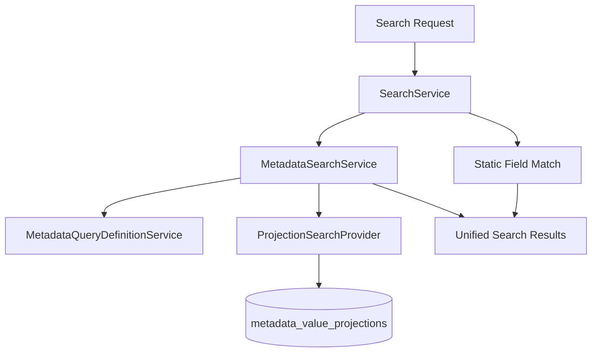

# P3 Metadata Phase 6D Impact Report

## Objectives Completed

- Introduced `MetadataSearchService` as the dedicated metadata-aware search coordinator for global search.
- Introduced `ProjectionSearchProvider` as the default projection-backed metadata search provider.
- Extended `SearchService` so Lead, Customer, and Opportunity global search combines static field matches with metadata matches.
- Enforced `is_searchable`, active status, and sensitive-field exclusion for metadata search participation.
- Preserved tenant isolation, RBAC module permissions, and the existing global search API shape.
- Added feature coverage for metadata search eligibility, composition, tenant isolation, permissions, projection usage, and query efficiency.

## Files Added

- `app/Services/MetadataSearchService.php`
- `app/Services/ProjectionSearchProvider.php`
- `tests/Feature/MetadataSearchIntegrationTest.php`
- `docs/P3_METADATA_PHASE_6D_IMPACT_REPORT.md`

## Files Modified

- `app/Services/SearchService.php`

## Architectural Impact

Phase 6D adds the first platform-wide metadata query consumer outside tenant index pages.

The global search flow is now:

`SearchService` remains an orchestrator. It does not compile metadata SQL, inspect `custom_fields`, or resolve metadata definitions directly.

No contract files were modified:

- `docs/METADATA_RUNTIME_CONTRACT.md`
- `docs/METADATA_VALIDATION_CONTRACT.md`
- `docs/METADATA_QUERY_CONTRACT.md`

## Runtime Impact

- Global search for Leads, Customers, and Opportunities now includes metadata matches from searchable, non-sensitive, active fields.
- Products, Quotations, Invoices, and Payments remain static-field search only.
- No metadata write path changed.
- No projection synchronization behavior changed.
- No entity JSON storage behavior changed.
- No index page, REST API, report, dashboard, saved filter, automation, or AI behavior changed.

## Search Integration Impact

- Existing static search fields and result shape are unchanged.
- Metadata matches are merged into the same result collection without exposing whether the match came from a static field or metadata value.
- Duplicate entity rows are avoided by composing static and metadata predicates in a single entity query.
- Initial metadata search modes supported: `contains` (default), `exact`, and `starts_with`.

## Performance Considerations

- Metadata search uses projection-backed `where exists` constraints against `metadata_value_projections`.
- Searchable field resolution is cached per request through `MetadataQueryDefinitionService`.
- Global search continues to limit each entity type to five records and the overall response to twenty records.
- Metadata search adds one projection-backed entity query per supported entity type, not one query per result row.
- No entity `custom_fields` JSON scans were introduced.

## Security Considerations

- Tenant context is required for metadata search execution.
- `OrganizationScope` continues to scope entity queries.
- Projection subqueries always include `organization_id`, `entity_type`, and `field_key`.
- Only active fields with `is_searchable = true` participate.
- Sensitive fields are excluded even when marked searchable.
- Inactive and archived definitions are excluded through definition resolution.
- RBAC module permissions continue to gate which entity types appear in global search results.

## Rollback Strategy

Rollback is limited to Phase 6D consumer integration:

1. Revert `SearchService` metadata composition changes.
2. Remove `MetadataSearchService` and `ProjectionSearchProvider`.
3. Remove `MetadataSearchIntegrationTest.php`.

No migrations, projection schema changes, or contract changes are required to roll back.

## Testing Summary

Added `tests/Feature/MetadataSearchIntegrationTest.php` covering:

- searchable metadata field matches
- non-searchable field exclusion
- inactive field exclusion
- sensitive field exclusion
- multiple searchable fields
- static plus metadata composition without duplicates
- static field backward compatibility
- tenant isolation
- RBAC module permission enforcement
- customer and opportunity metadata search
- exact and starts-with search modes
- projection-backed SQL usage
- absence of JSON column queries
- single projection query per metadata-enabled entity search

Verification commands:

- `php artisan test --filter=Metadata`
- `php artisan test`

## Future Dependencies

Phase 6D enables later consumers to reuse the same search stack:

- Reports and dashboards can adopt `MetadataSearchService` for metadata-aware lookup without duplicating projection SQL.
- REST APIs can expose structured metadata search through the same service boundary.
- Saved filters, automation, and AI retrieval can intersect metadata search matches with authorized entity builders.
- Optional external providers (`ElasticsearchProvider`, `OpenSearchProvider`) can replace `ProjectionSearchProvider` behind the same service boundary without changing `SearchService`.

Remaining non-goals for later phases:

- fuzzy search, stemming, typo correction, and relevance ranking
- Platform Administration metadata search
- organization platform index metadata search
- saved filters, reports, dashboards, REST APIs, automation, and AI integration
