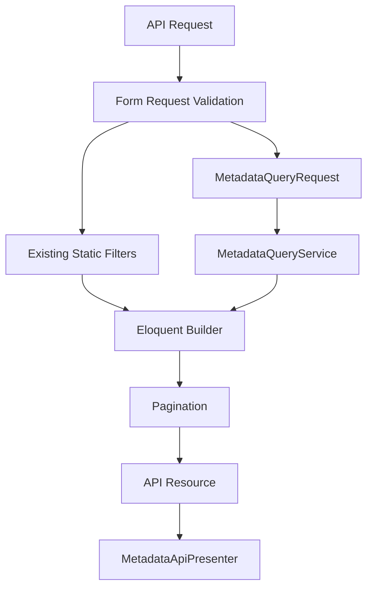

# P3 Metadata Phase 6E Impact Report

## Objectives Completed

- Extended tenant REST APIs for Leads, Customers, and Opportunities with metadata filtering and sorting through the existing Metadata Query Platform.
- Added API-specific metadata request normalization via `requestForApi()` and `applyForApi()`.
- Enforced `is_api_visible`, active status, and sensitive-field exclusion for API metadata output.
- Introduced `MetadataApiPresenter` so API resources do not inspect metadata definitions directly.
- Added Opportunities REST list and show endpoints as a metadata-aware API consumer.
- Preserved backward compatibility for existing API query parameters and response shapes.
- Added feature coverage for filtering, sorting, visibility, pagination, validation, security, tenant isolation, RBAC, and projection-backed query execution.

## Files Added

- `app/Services/MetadataApiPresenter.php`
- `app/Http/Requests/Concerns/ValidatesApiMetadataQuery.php`
- `app/Http/Requests/IndexApiLeadRequest.php`
- `app/Http/Requests/IndexApiCustomerRequest.php`
- `app/Http/Requests/IndexApiOpportunityRequest.php`
- `app/Http/Controllers/Api/OpportunityController.php`
- `app/Http/Resources/OpportunityResource.php`
- `tests/Feature/MetadataApiIntegrationTest.php`
- `docs/P3_METADATA_PHASE_6E_IMPACT_REPORT.md`

## Files Modified

- `app/Services/MetadataQueryDefinitionService.php`
- `app/Services/MetadataQueryService.php`
- `app/Http/Controllers/Api/LeadController.php`
- `app/Http/Controllers/Api/CustomerController.php`
- `app/Http/Resources/LeadResource.php`
- `app/Http/Resources/CustomerResource.php`
- `routes/api.php`

## Architectural Impact

Phase 6E makes tenant REST APIs a first-class consumer of the frozen Metadata Query Platform.

The API list flow is now:

Controllers remain thin orchestrators. Metadata SQL, projection joins, and definition resolution stay in application services.

No contract files were modified:

- `docs/METADATA_RUNTIME_CONTRACT.md`
- `docs/METADATA_VALIDATION_CONTRACT.md`
- `docs/METADATA_QUERY_CONTRACT.md`

## Runtime Impact

- `GET /api/v1/leads`, `GET /api/v1/customers`, and the new `GET /api/v1/opportunities` endpoints accept structured `metadata_filters` and `metadata_sort`.
- API show responses now include a `custom_fields` object filtered to API-visible, non-sensitive, active metadata.
- Existing static filters (`status`, `search`, `stage`) continue to work unchanged.
- Lead intake POST behavior is unchanged.
- No metadata write path, projection sync behavior, or entity JSON storage behavior changed.

## API Impact

- Backward compatible: existing clients can ignore the new `custom_fields` key and metadata query parameters.
- API metadata validation is stricter than web index parsing:
  - unknown or inactive fields return 422
  - non-filterable, non-sortable, non-API-visible, and sensitive fields return 422
  - unsupported operators return 422
- Pagination remains Laravel-native with `per_page` capped at 100.
- Opportunities now have read-only REST endpoints aligned with Leads and Customers.

## Security Considerations

- Entity permissions continue to gate API access through Form Request authorization and policies on show endpoints.
- Tenant context is required and enforced by middleware, `MetadataQueryRequest`, and `MetadataQueryService`.
- API output excludes sensitive, inactive, and non-API-visible metadata values.
- API metadata filters and sorts require both the relevant query capability and `is_api_visible`.
- Cross-tenant metadata matches remain impossible through organization-scoped entity and projection constraints.

## Performance Considerations

- Metadata filters use projection-backed `where exists` constraints.
- Metadata sorts use projection-backed joins with entity primary key tie-breakers.
- API list endpoints do not query entity `custom_fields` JSON for filtering or sorting.
- `MetadataApiPresenter` resolves API-visible definitions once per resource row through cached definition lookups.
- Metadata list queries add one projection-backed constraint set per request, not one query per result row.

## Rollback Strategy

Rollback is limited to Phase 6E consumer integration:

1. Revert API controller, resource, route, and Form Request changes.
2. Remove `MetadataApiPresenter`, `requestForApi()`, `applyForApi()`, and API-specific parse validation.
3. Remove `MetadataApiIntegrationTest.php`.

No migrations or contract changes are required to roll back.

## Testing Summary

Added `tests/Feature/MetadataApiIntegrationTest.php` covering:

- Leads API metadata filtering, sorting, visibility, and pagination
- Customers API metadata filtering, sorting, and visibility
- Opportunities API metadata filtering, sorting, and visibility
- sensitive, inactive, and non-API-visible field exclusion
- tenant isolation
- RBAC permission enforcement
- rejection of unknown fields, invalid operators, malformed filters, and unsupported metadata capabilities
- projection-backed SQL usage
- absence of JSON column queries
- single projection query per metadata-filtered list request
- backward compatibility for existing API parameters

Verification commands:

- `php artisan test --filter=Metadata`
- `php artisan test`

## Future Dependencies

Phase 6E enables later consumers to reuse the same API query stack:

- Saved filters can serialize validated `metadata_filters` and execute through `requestForApi()`.
- Reports and dashboards can adopt the same request normalization with different contexts.
- Automation and AI retrieval can intersect API metadata query results with authorized entity builders.
- Additional tenant API endpoints can adopt the same Form Request + `MetadataQueryRequest` pattern without new query infrastructure.

Remaining non-goals for later phases:

- reporting and dashboard metadata consumers
- saved filters, automation, and AI context retrieval
- platform administration APIs
- external search engines
