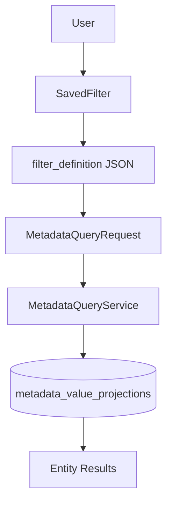

# P3 Metadata Phase 6F Impact Report

## Objectives Completed

- Introduced reusable Saved Filters as persisted metadata query definitions for Leads, Customers, and Opportunities.
- Added `SavedFilter` model and `SavedFilterService` for create, update, delete, duplicate, validate, and execute operations.
- Saved filter execution rebuilds `MetadataQueryRequest` and applies filters exclusively through `MetadataQueryService`.
- Added private and shared visibility within an organization with ownership-aware policies.
- Integrated saved filter load/save/rename/delete controls into Lead, Customer, and Pipeline index pages.
- Added revalidation of saved definitions against current metadata capabilities and field lifecycle state.
- Added feature coverage for CRUD, sharing, execution, validation, tenant isolation, permissions, sorting, and projection-backed queries.

## Files Added

- `database/migrations/2026_07_10_000001_create_saved_filters_table.php`
- `app/Models/SavedFilter.php`
- `app/Services/SavedFilterService.php`
- `app/Policies/SavedFilterPolicy.php`
- `app/Http/Controllers/SavedFilterController.php`
- `app/Http/Controllers/Concerns/AppliesSavedIndexFilters.php`
- `app/Http/Requests/StoreSavedFilterRequest.php`
- `app/Http/Requests/UpdateSavedFilterRequest.php`
- `resources/views/metadata-fields/_saved_filter_controls.blade.php`
- `tests/Feature/MetadataSavedFilterIntegrationTest.php`
- `docs/P3_METADATA_PHASE_6F_IMPACT_REPORT.md`

## Files Modified

- `app/Http/Controllers/LeadController.php`
- `app/Http/Controllers/CustomerController.php`
- `app/Http/Controllers/OpportunityController.php`
- `app/Providers/AppServiceProvider.php`
- `resources/views/leads/index.blade.php`
- `resources/views/customers/index.blade.php`
- `resources/views/pipeline/index.blade.php`
- `resources/views/components/flash-messages.blade.php`
- `routes/web.php`

## Architectural Impact

Phase 6F introduces the first reusable metadata query definition consumer beyond live index/API requests.

Saved filters store query intent only. They never store result sets, SQL, or projection rows.

No contract files were modified:

- `docs/METADATA_RUNTIME_CONTRACT.md`
- `docs/METADATA_VALIDATION_CONTRACT.md`
- `docs/METADATA_QUERY_CONTRACT.md`

## Runtime Impact

- Lead, Customer, and Pipeline index pages accept `saved_filter={id}` to replay stored filter definitions.
- Users can save, rename, duplicate, and delete filters from index pages.
- Existing manual filter behavior remains unchanged when no saved filter is selected.
- No metadata write path, projection sync behavior, or entity JSON storage behavior changed.

## Security Considerations

- Saved filters are tenant-scoped through `BelongsToOrganization`.
- Private filters are visible and executable only by their creator.
- Shared filters are visible to organization members with the relevant entity view permission.
- Update and delete require ownership or `metadata.manage` for shared filters owned by another user.
- Cross-tenant saved filter access is rejected at lookup time.
- Entity policies continue to gate index access before saved filter execution.

## Performance Considerations

- Saved filters store JSON definitions only; no query result caching was introduced.
- Execution reuses the existing projection-backed `MetadataQueryService` compiler.
- Revalidation compiles against an empty builder to detect obsolete operators or capabilities without returning business rows.
- Index pages load available saved filters with one scoped query per entity index request.

## Rollback Strategy

Rollback is limited to Phase 6F consumer integration:

1. Remove saved filter routes, controller, policy, service, model, and migration rollback.
2. Revert index controller and view integration changes.
3. Remove `MetadataSavedFilterIntegrationTest.php`.

No contract or projection schema changes beyond the additive `saved_filters` table are required to roll back execution behavior.

## Testing Summary

Added `tests/Feature/MetadataSavedFilterIntegrationTest.php` covering:

- saved filter creation, update, and deletion
- private visibility isolation
- shared filter execution by organization members
- projection-backed saved filter execution
- inactive metadata revalidation and partial execution behavior
- unsupported operator validation
- tenant isolation
- entity permission enforcement
- metadata sorting through saved filters
- duplication

Verification commands:

- `php artisan test --filter=Metadata`
- `php artisan test`

## Future Dependencies

Phase 6F enables later consumers to reuse the same saved filter definitions:

- Reports can execute stored `filter_definition` payloads through `SavedFilterService`.
- Dashboards can bind widgets to saved filters without duplicating metadata SQL.
- Automation and AI retrieval can load validated query intent from saved filters and intersect results with authorized entity builders.

Remaining non-goals for later phases:

- reports and dashboards
- workflow automation and AI context retrieval
- scheduled reports
- public or cross-tenant sharing
- platform administration saved filters
