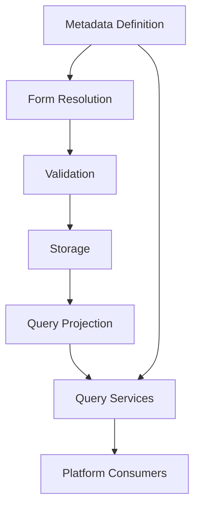
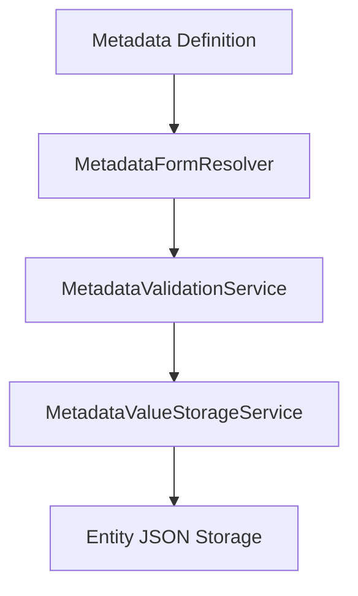
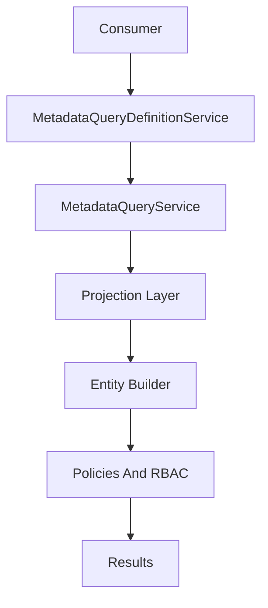
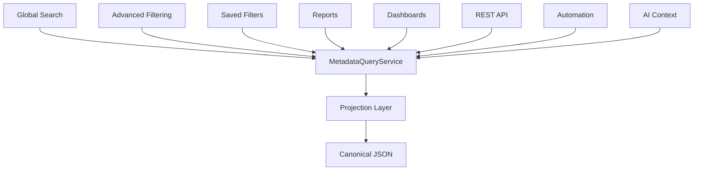

# P3 Phase 6 Metadata Query And Indexing Technical Design Specification

## Status

This document is the implementation blueprint for P3 Phase 6. It defines architecture only.

No code, migrations, services, models, controllers, UI, or tests should be implemented until this TDS and the companion query contract are approved.

Official metadata platform contracts:

- `docs/METADATA_RUNTIME_CONTRACT.md`
- `docs/METADATA_VALIDATION_CONTRACT.md`
- `docs/METADATA_QUERY_CONTRACT.md`

Together they define the complete metadata lifecycle:



## Scope

Phase 6 defines the Metadata Query and Indexing Layer for:

- Global search.
- Advanced filtering.
- Saved filters.
- Reporting.
- Dashboards.
- REST API filtering.
- Future automation.
- Future AI context retrieval.

The design strengthens the approved hybrid projection architecture. It does not redesign the metadata runtime, validation, or write path.

## Non-Goals

Phase 6 does not:

- Redesign `custom_fields` JSON storage.
- Replace `MetadataFormResolver`.
- Replace `MetadataValidationService`.
- Replace `MetadataValueStorageService`.
- Move validation into query services.
- Make projections canonical business data.
- Write user-submitted metadata directly into projections.
- Introduce repositories, DDD, CQRS, event sourcing, generic base services, workflow engines, or generic query builders.
- Introduce an external search engine as a Phase 6 dependency.
- Implement arbitrary SQL, arbitrary nested query expressions, or user-defined query code.

## Frozen Platform Boundaries

The current approved runtime pipeline remains unchanged:



Runtime rules that Phase 6 must preserve:

- Entity `custom_fields` JSON remains the canonical current-value store.
- JSON values are keyed by `MetadataFieldDefinition.key`.
- Validation remains the pre-storage accept/reject boundary.
- Storage remains the normalization and merge boundary.
- Storage does not update query projections.
- Future consumers address metadata values by stable field key.

## Architectural Principles

- One Read Path: all metadata search, filter, sort, report, API, automation, and AI retrieval behavior uses the Metadata Query Layer.
- One Validation Path: metadata writes continue through `MetadataValidationService` or an approved orchestration service that delegates to it.
- One Write Path: metadata writes continue through `MetadataValueStorageService`.
- JSON as Canonical Storage: projection never replaces entity JSON.
- Projection as Query Infrastructure: projection rows are typed, indexed, derived, and rebuildable.
- Laravel-native Services: concrete services fit the existing Controllers -> Form Requests -> Services -> Models architecture.
- Tenant-first Design: projection rows, indexes, rebuilds, and queries are organization-scoped first.
- Capability-driven Queries: query eligibility comes from metadata definition flags.
- RBAC-first Access: authorization is enforced before metadata predicates are compiled and before results are returned.
- Rebuildable Read Model: projection drift is repaired by rebuilding from canonical JSON.
- Consumer Reuse over Duplication: consumers must not implement their own metadata query logic.

## Official Read Architecture

The official read pipeline is:



Responsibilities:

- Consumer: submits structured query intent for one platform capability.
- `MetadataQueryDefinitionService`: resolves active, authorized, capability-eligible definitions for the tenant and entity type.
- `MetadataQueryService`: compiles validated metadata query intent into Eloquent constraints.
- Projection Layer: provides typed, tenant-scoped query rows derived from entity JSON.
- Entity Builder: remains the normal Eloquent query for the target model.
- Policies and RBAC: enforce entity, module, metadata, API, and sensitivity permissions.
- Results: return authorized entities, search matches, or aggregates.

Every metadata-aware consumer must use this read pipeline. Direct JSON predicates and direct projection-table predicates are reserved for internal rebuild, drift detection, and verification tooling.

## Recommended Service Layer

### MetadataQueryDefinitionService

Purpose:

- Resolve queryable metadata definitions for a tenant, entity type, and capability.

Responsibilities:

- Filter by `organization_id`, `entity_type`, active status, and capability flag.
- Enforce `is_filterable`, `is_sortable`, `is_searchable`, `is_reportable`, `is_exportable`, `is_api_visible`, and `is_sensitive`.
- Resolve option-backed metadata needed for query validation and display.
- Exclude unauthorized fields from consumer-visible query options.
- Cache active query definitions per request where safe.

Non-responsibilities:

- Does not validate writes.
- Does not update projections.
- Does not execute entity queries.

### MetadataQueryService

Purpose:

- Compile structured metadata query intent into reusable Eloquent constraints.

Responsibilities:

- Validate query keys, operators, values, tenant context, capability context, and RBAC context.
- Normalize query comparison values by field type without mutating entity JSON.
- Apply projection-backed filters and sorts to the target entity builder.
- Preserve normal Laravel scopes, policies, eager loading, and pagination behavior.
- Reject unknown fields, inactive fields, unsupported operators, unauthorized fields, and capability violations.

Strict boundaries:

- Never performs writes.
- Never updates projections.
- Never repairs data.
- Never mutates metadata definitions.
- Never mutates entity `custom_fields`.
- Never performs metadata write validation.
- Never bypasses RBAC.
- Never bypasses tenant isolation.
- Never exposes raw SQL or arbitrary query fragments as a consumer API.

### MetadataProjectionService

Purpose:

- Maintain projection rows derived from canonical JSON values.

Responsibilities:

- Read entity `custom_fields`.
- Resolve relevant metadata definitions.
- Generate typed projection rows.
- Upsert and delete projection rows.
- Rebuild one entity, one field, one organization/entity type, or all projections.
- Detect and repair projection drift.

Non-responsibilities:

- Does not validate metadata input.
- Does not accept user-submitted values as a projection write target.
- Does not decide user query authorization.
- Does not return platform query results.

### MetadataSearchService

Purpose:

- Coordinate metadata-aware search for global search and future search consumers.

Responsibilities:

- Accept structured metadata search intent.
- Resolve searchable definitions through `MetadataQueryDefinitionService`.
- Enforce tenant context, entity permissions, search capability flags, API visibility where relevant, and sensitivity rules.
- Delegate search lookup to the configured `MetadataSearchProvider`.
- Intersect metadata search matches with authorized entity builders before results are returned.
- Return search results with authorized labels, snippets, or entity references.

Non-responsibilities:

- Does not write metadata values.
- Does not update projections.
- Does not rebuild projections.
- Does not bypass `MetadataQueryService` for filters or sorts.
- Does not treat external search provider results as authorization decisions.
- Does not expose sensitive snippets unless explicitly authorized by future policy.

### MetadataSearchProvider

Purpose:

- Provide a stable boundary for current and future metadata search implementations.

Providers:

- `ProjectionSearchProvider`: default Phase 6 provider using relational projection rows.
- `ElasticsearchProvider`: future optional provider.
- `OpenSearchProvider`: future optional provider.

Rules:

- Phase 6 continues using relational projections as the primary query source.
- Search providers may accelerate full-text search, relevance ranking, and fuzzy matching later.
- Search providers are not the source of truth for authorization, filtering, sorting, reporting, saved filters, automation, or AI context retrieval.
- Search provider matches must be intersected with authorized entity builders before results are returned.

### MetadataReportQueryService

Purpose:

- Provide metadata-aware report filters, groupings, and dimensions.

Responsibilities:

- Use `MetadataQueryDefinitionService` for reportable fields.
- Use `MetadataQueryService` for report filters.
- Restrict groupings to field types with stable grouping behavior.
- Preserve report permissions and tenant scoping.

Non-responsibilities:

- Does not calculate unrelated business metrics.
- Does not write metadata values.
- Does not update or rebuild projections.
- Does not allow non-reportable fields to be used as report dimensions.
- Does not bypass report permissions or entity authorization.

### MetadataSavedFilterService

Purpose:

- Store and execute reusable metadata-aware filter definitions when saved filters are implemented.

Responsibilities:

- Store structured filter intent using field keys, operators, values, and context.
- Revalidate definitions, permissions, sensitivity, and capability flags at execution time.
- Mark saved filters invalid or partially invalid when referenced fields are removed or no longer queryable.

Non-responsibilities:

- Does not store raw SQL.
- Does not query projection rows directly.
- Does not write metadata values.
- Does not update or rebuild projections.
- Does not preserve access to fields that the current user can no longer query.

## Projection Architecture

Final recommendation: hybrid projection.

- Keep entity `custom_fields` JSON as canonical current-value storage.
- Add a relational metadata value projection as the authoritative query index.
- Use optional future search providers only as downstream acceleration.
- Never write user-submitted metadata directly into projection rows.

Projection data is:

- Derived.
- Tenant-scoped.
- Typed.
- Indexed.
- Rebuildable.
- Non-canonical.

If projection data disagrees with entity JSON, entity JSON wins.

## Projection Ownership

JSON remains the canonical source of truth.

Projection rows:

- Contain no independent business state.
- Must never be edited as metadata values.
- Must never be used as a write target.
- Must never be the only copy of a metadata value.
- May be deleted and regenerated safely.
- Are always regenerated from entity JSON plus metadata definitions.
- May lag canonical JSON if queued synchronization is enabled.

Projection deletion and regeneration must be supported as normal operational behavior, not an exceptional disaster-recovery-only path.

## Projection Model

Logical projection row fields:

- `organization_id`
- `entity_type`
- `entity_id`
- `metadata_field_definition_id`
- `field_key`
- `field_type`
- `value_text`
- `value_string`
- `value_number`
- `value_decimal`
- `value_boolean`
- `value_date`
- `value_datetime`
- `value_time`
- `value_json`
- `normalized_search_text`
- `is_sensitive`
- `definition_status`
- `projected_at`
- `source_updated_at`

Recommended row strategy:

- Scalar fields: one row per `(organization_id, entity_type, entity_id, field_key)`.
- Multi-select fields: one row per selected option for efficient membership filtering, with optional JSON copy for diagnostics.

Index principles:

- Every query index starts with `organization_id`.
- Common filter index: `(organization_id, entity_type, field_key, typed_value, entity_id)`.
- Common sort index: `(organization_id, entity_type, field_key, typed_value, entity_id)`.
- Entity sync index: `(organization_id, entity_type, entity_id)`.
- Multi-select uniqueness includes the selected option value or value hash.

## Projection Lifecycle

Initial Projection:

- Backfill existing entity JSON by organization and entity type.
- Chunk records to keep memory and locks bounded.
- Generate rows from canonical JSON and metadata definitions.
- Make the job idempotent and restartable.

Incremental Synchronization:

- Run after successful entity metadata persistence.
- Read the saved entity state, not raw request input.
- Upsert rows for changed values.
- Delete rows for cleared values.
- Leave omitted values unchanged unless a full entity sync is requested.

Reprojection After Updates:

- Reproject a single entity after create, update, conversion, import, or future automation writes.
- Use after-commit dispatch when queued execution is selected.
- Allow synchronous reprojection where immediate consistency is required.

Definition Changes:

- Capability changes affect query eligibility immediately.
- Label changes do not require projection rebuild.
- Option label changes do not require value rebuild.
- Field type corrections, if ever allowed after publication, require field-level reprojection.
- Deactivation removes query availability immediately but does not require immediate row deletion.
- Archival excludes the field from normal query compilation.

Full Rebuild:

- Rebuild one entity.
- Rebuild one field definition.
- Rebuild one organization/entity type.
- Rebuild all projection rows.
- Rebuild jobs are idempotent, restartable, tenant-scoped, and chunked.

Drift Detection:

- Compare canonical JSON against projection rows.
- Report missing, stale, extra, incorrectly typed, and cross-definition rows.
- Do not mutate business data during detection.

Recovery:

- Delete incorrect projection rows.
- Regenerate from canonical JSON.
- Retry safely without duplicate logical rows.

Archival Behaviour:

- Soft-deleted entities are excluded by the entity builder.
- Projection rows for soft-deleted entities may be retained or purged by operational policy.
- Archived definitions are not queryable by default.
- Historical reporting on archived fields requires a separate approved administrative mode.

## Query Request Model

Consumers submit structured query intent. The implementation may use DTOs or request objects, but the logical model is:

```json
{
  "organization_id": 123,
  "entity_type": "lead",
  "context": "web_index",
  "filters": [
    {
      "key": "visa_type",
      "operator": "equals",
      "value": "student"
    }
  ],
  "sort": {
    "key": "ielts_score",
    "direction": "desc"
  },
  "search": {
    "term": "canada",
    "mode": "contains"
  },
  "pagination": {
    "page": 1,
    "per_page": 15
  }
}
```

Rules:

- `organization_id` comes from `TenantContext` or an explicit trusted service context.
- `entity_type` must be configured as metadata-enabled.
- `context` identifies the consuming surface.
- Filter and sort keys must reference active authorized definitions.
- Sort direction is limited to `asc` or `desc`.
- Search uses only searchable definitions.
- API metadata queries require `is_api_visible`.

## Supported Operators

Text-like fields: `text`, `textarea`, `email`, `url`, `phone`.

- `equals`
- `not_equals`
- `contains`
- `not_contains`
- `starts_with`
- `ends_with`
- `is_empty`
- `is_not_empty`

Numeric fields: `number`, `decimal`, `currency`, `percentage`, `user`, `team`.

- `equals`
- `not_equals`
- `gt`
- `gte`
- `lt`
- `lte`
- `between`
- `is_empty`
- `is_not_empty`

Temporal fields: `date`, `datetime`, `time`.

- `equals`
- `before`
- `after`
- `on_or_before`
- `on_or_after`
- `between`
- `is_empty`
- `is_not_empty`

Boolean fields:

- `is_true`
- `is_false`
- `is_empty`
- `is_not_empty`

Option-backed fields: `select`, `radio`, `multi_select`.

- `equals`
- `not_equals`
- `in`
- `not_in`
- `is_empty`
- `is_not_empty`

Multi-select-specific:

- `contains_any`
- `contains_all`
- `contains_none`

Operator constraints:

- Sorting is allowed only when `is_sortable` is true.
- Filtering is allowed only when `is_filterable` is true.
- Searching is allowed only when `is_searchable` is true.
- Reporting is allowed only when `is_reportable` is true.
- Long text `contains` behavior may be limited until a search provider is introduced.
- Unsupported operators are rejected rather than emulated through slow JSON scans.

## Query Response Guarantees

The query layer guarantees:

- Tenant-scoped results.
- Entity authorization is preserved.
- Metadata capability flags are enforced.
- Sensitive metadata is excluded unless explicitly authorized by future policy.
- Sorting by metadata has a deterministic entity primary-key tie breaker.
- Projection-backed comparisons use typed columns where possible.
- Empty metadata values follow the runtime contract: missing keys and cleared values are represented by absent projection rows unless a field-specific projection rule defines otherwise.
- `is_empty` and `is_not_empty` distinguish absent values from stored falsey values such as boolean `false`, numeric `0`, and string `"0"`.
- Pagination is applied to the authorized entity builder after metadata predicates are compiled.
- Paginated metadata sorts remain stable because entity primary key is used as a deterministic tie breaker.
- Unknown, inactive, archived, deleted, unauthorized, or unsupported fields cannot be used silently as raw predicates.
- Saved filters are revalidated at execution time.

The query layer does not guarantee:

- Projection rows are canonical business data.
- External search providers are immediately consistent.
- Direct JSON query parity for unsupported operators.
- Query access by field label.

## Consumer Architecture

All platform consumers use the same query services:



Consumer-specific rules:

- Global Search: uses `MetadataSearchService`, `is_searchable`, module permissions, tenant context, and the configured `MetadataSearchProvider`.
- Advanced Filtering: uses `is_filterable` and finite field-type-specific operators.
- Saved Filters: store structured query intent and revalidate at execution time.
- Reports: use `is_reportable` for filters and dimensions.
- Dashboards: use the report/query layer for metadata-backed metrics.
- REST API: requires `is_api_visible` plus the relevant query capability.
- Automation: uses query services for candidate retrieval and never queries JSON directly.
- AI Context: uses query services and excludes sensitive fields by default.

No consumer should implement independent metadata query logic.

## Security, RBAC, And Tenant Isolation

Tenant isolation:

- Projection rows include `organization_id`.
- Projection joins include `organization_id`, `entity_type`, and field identity.
- Entity IDs are never joined without organization constraints.
- Tenant context is resolved before query compilation.
- Platform cross-tenant reads require explicit platform services.

RBAC:

- Entity policies and module permissions are checked first.
- Metadata capability flags are mandatory gates.
- Sensitive fields are excluded from search, API output, export, reports, saved filter display, automation, and AI context unless an explicit future sensitive-access policy allows them.
- Field-level metadata permissions, when completed, are enforced in `MetadataQueryDefinitionService`.
- API metadata filtering and output require `is_api_visible`.

Saved filter security:

- Saved filters store field keys, operators, values, and context.
- Saved filters do not store SQL.
- Saved filters are revalidated against current definitions and permissions at execution time.

## Performance Strategy

Targets:

- Millions of records.
- Hundreds of metadata fields per tenant.
- Thousands of tenants.
- Common filters and sorts inside normal web latency budgets.
- Online rebuilds without application downtime.

Strategies:

- Use typed projection columns for indexed comparisons.
- Keep all query indexes organization-first.
- Avoid broad JSON scans in production query paths.
- Avoid per-tenant or per-field schema changes as the default strategy.
- Cache active query definitions per request.
- Add deterministic tie breakers to metadata sorts.
- Chunk rebuilds by organization, entity type, and entity ID range.
- Track projection lag, rebuild progress, drift counts, and slow metadata queries.
- Defer relevance search and fuzzy matching to future search providers.

## Indexing Strategy Analysis

JSON-only queries:

- Benefit: no duplicated data.
- Cost: weak indexing for arbitrary tenant fields, poor sorting, poor reporting, database-specific query behavior, and expensive global search.
- Verdict: not sufficient for enterprise Phase 6 workloads.

Generated columns or per-field physical columns:

- Benefit: strong performance for fixed system fields.
- Cost: schema churn, index explosion, tenant variability, and operational risk.
- Verdict: not the default strategy.

External search index as primary source:

- Benefit: excellent full-text retrieval and ranking.
- Cost: eventual consistency, operational dependency, weaker relational filtering/reporting, and complex authorization boundaries.
- Verdict: future accelerator only.

Relational projection:

- Benefit: tenant-scoped, typed, indexable, Laravel-native, rebuildable, and suitable for filters, sorts, reports, APIs, automation, and AI retrieval.
- Cost: duplicated derived data, synchronization, rebuild tooling, and observability.
- Verdict: approved default.

Final recommendation:

- Canonical JSON plus relational projection as the Phase 6 read model.
- Future search providers may accelerate search without changing the core query architecture.

## Migration And Rebuild Strategy

Phase 6 implementation must be additive.

Initial rollout:

- Add projection schema without changing entity JSON.
- Backfill from existing `custom_fields`.
- Enable projection synchronization for new writes.
- Verify projection results against JSON-derived expected values in tests and controlled environments.
- Enable consumers in phases behind configuration or feature flags.

Operational tooling:

- Rebuild one entity.
- Rebuild one metadata field.
- Rebuild one organization/entity type.
- Rebuild all projections.
- Detect drift.
- Repair drift.
- Monitor lag and throughput.

Rollback posture:

- Disable consumer usage of metadata projection.
- Continue using canonical JSON for writes and displays.
- Delete and regenerate projection rows if needed.
- No business data is lost by removing projection data.

## Implementation Roadmap

Phase 6A: Query contract and projection foundation.

- Approve `METADATA_QUERY_CONTRACT.md`.
- Add projection schema and model.
- Build `MetadataProjectionService`.
- Add rebuild and drift detection commands.
- Test projection generation by field type.

Phase 6B: Query compiler.

- Build `MetadataQueryDefinitionService`.
- Build `MetadataQueryService`.
- Implement operator matrix and query value normalization.
- Test tenant isolation, permissions, sensitivity, and unsupported operators.

Phase 6C: Entity list filtering and sorting.

- Integrate leads, customers, and opportunities.
- Preserve existing static filters.
- Add metadata filters and sorts for active authorized fields only.

Phase 6D: Global search.

- Add `MetadataSearchProvider` boundary.
- Use `ProjectionSearchProvider` by default.
- Integrate searchable metadata into existing global search.

Phase 6E: REST API filtering and visibility.

- Add structured metadata filters to supported endpoints.
- Return metadata only for `is_api_visible` fields.
- Enforce API pagination bounds and sensitivity policy.

Phase 6F: Reports, dashboards, and saved filters.

- Add metadata report filters and dimensions.
- Add saved filter persistence and execution.
- Revalidate saved filters on execution.

Phase 6G: Automation and AI readiness.

- Expose approved internal query use cases through metadata query services.
- Enforce the same RBAC, tenant, capability, and sensitivity rules.

## Testing Strategy

Core tests:

- Projection sync for each supported field type.
- Clear and delete semantics.
- Boolean false preservation.
- Empty and null behavior.
- Multi-select option rows.
- Tenant isolation on every projection join.
- Capability flag enforcement.
- Sensitive field exclusion.
- Idempotent rebuilds.
- Drift detection and repair.
- Unsupported operator rejection.

Integration tests:

- Lead, customer, and opportunity index metadata filters.
- Static filters combined with metadata filters.
- Metadata sorting with deterministic tie breaker.
- Global search respects metadata search flags and permissions.
- API filters respect `is_api_visible`.
- Report filters and dimensions respect `is_reportable`.
- Saved filters revalidate stale field references.

Performance tests:

- High-volume tenants with many metadata fields.
- Index usage for common operators.
- Rebuild throughput and queue lag.
- Slow query logging for metadata filters and sorts.

## Risks And Mitigations

Projection drift:

- Mitigate with after-commit sync, idempotent rebuilds, drift detection, and repair tooling.

Index growth:

- Mitigate with typed shared indexes and capability-driven query eligibility.

Eventual consistency:

- Use synchronous projection where immediate consistency is required and queued projection where scale requires it.

Sensitive data leakage:

- Exclude sensitive fields by default from search, API, reports, exports, saved filters, automation, and AI context.

Tenant leakage:

- Enforce organization-first query indexes and tests that prove cross-tenant projection rows cannot affect results.

Consumer duplication:

- Make `MetadataQueryService` the only approved metadata predicate compiler.

Search provider complexity:

- Keep relational projection as the Phase 6 default and introduce external search only behind the `MetadataSearchProvider` boundary later.

## Review Checkpoints

Architecture review:

- Approve the three-contract platform model and one-read-path rule.

Data model review:

- Approve projection row shape, typed columns, multi-select row strategy, and tenant-first indexes.

Security review:

- Approve RBAC, sensitivity, API visibility, saved filter, automation, and AI retrieval policies.

Performance review:

- Approve index strategy, rebuild approach, and observability requirements.

Product review:

- Approve supported operators, initial consumer rollout order, and saved filter behavior.

Implementation readiness review:

- Confirm contracts, tests, feature flags, rollback strategy, and operational tooling before coding begins.

## Final CTO Recommendation

Proceed with the Laravel-native hybrid query architecture: canonical JSON storage, tenant-scoped relational projection, concrete metadata query services, and a future-proof search provider boundary.

This establishes metadata querying as a first-class platform contract while preserving the approved one read path, one validation path, and one write path.
