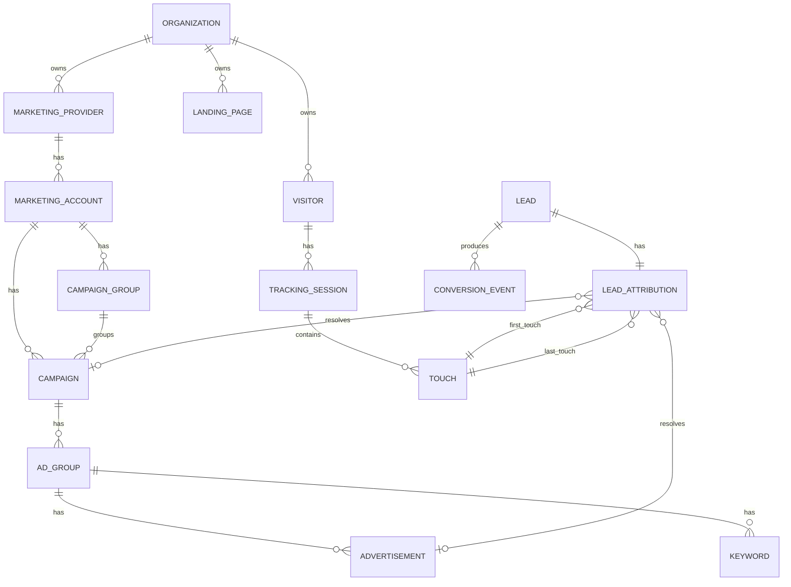
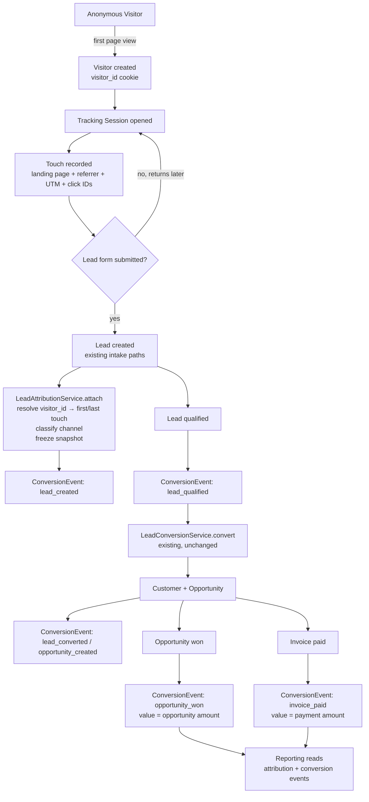
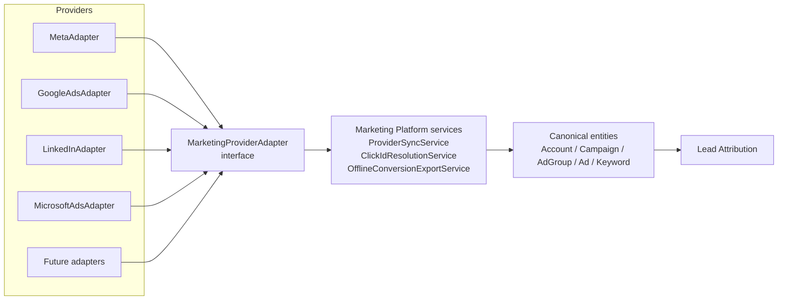

# P7 Marketing Attribution Platform Technical Design Specification

## Status

- Phase: P7A (Architecture) → implemented through P7B.6; contracts frozen in **P7B.F**
- State: **Approved / Stable** (foundation freeze)
- Companion contracts: `docs/MARKETING_ATTRIBUTION_CONTRACT.md`, `docs/MARKETING_PLATFORM_OVERVIEW.md`, and the P7B.F runtime contracts
- Foundation implementation (7B.1–7B.6) is complete. Provider integrations begin at Phase 7C against the frozen contracts. Do not renegotiate platform-core write authorities in later phases.

## Scope

Design the Marketing Attribution Platform: the single source of truth for every lead source entering Konnect Nex. The platform captures anonymous traffic, records touches, attributes leads, follows attribution through the CRM revenue chain, and exposes canonical entities that all providers and reports consume.

In scope for this document:

1. Marketing data model and ownership.
2. Lead attribution lifecycle.
3. Traffic source taxonomy.
4. Tracking parameter capture and storage evaluation.
5. Provider abstraction boundary.
6. Lead lifecycle attribution (first touch, last touch, revenue).
7. Reporting requirements (design only).
8. REST API requirements (design only).
9. Security model.
10. Performance and retention strategy.
11. Implementation roadmap (P7A–P7I).

## Non-Goals

- No implementation in this phase.
- No campaign management (creating/editing campaigns on provider platforms).
- No multi-touch credit allocation in v1 (the data model must support it; the algorithms are future work).
- No consent-management UI (tenants embed the tracking script behind their own consent tooling).
- No cross-device identity stitching.
- No changes to existing CRM entities beyond additive attribution linkage.

## Frozen Platform Boundaries

These boundaries are fixed and may not be renegotiated by later phases:

1. The Marketing Attribution Platform is the only attribution authority. Providers, forms, imports, and APIs write through it; reports read from it.
2. Providers are plugins behind an adapter boundary. No canonical table, service, or API may reference a specific provider except through the provider slug.
3. Every platform table is tenant-owned via `organization_id` and `BelongsToOrganization`, following the existing `OrganizationScope` global scope.
4. Existing CRM architecture (Controllers → Form Requests → Services → Models, Policies, RBAC, Audit Logging, Notifications, Transactions) is unchanged. The platform adds new classes in the same layers; it introduces no new architectural styles.
5. Prohibited patterns remain prohibited: no Repository Pattern, DDD, CQRS, Event Sourcing, Generic Base Services, or Workflow Engines. Touches and conversion events are append-only tables read directly with Eloquent — this is immutable data, not event sourcing (no replay, no projections-as-truth, no event store).
6. Existing lead intake (`POST /api/v1/leads`), lead conversion (`LeadConversionService`), and revenue reporting (`RevenueService`) keep their current contracts. The platform hooks into them additively.

## Architectural Principles

The platform follows the established Konnect Nex stack exactly:

```
Controllers (web + Api + public tracking endpoint)
        ↓
Form Requests (tenant-constrained validation)
        ↓
Services (transactions, audit, notifications)
        ↓
Models (BelongsToOrganization, Auditable where mutable)
```

Supporting layers reused as-is:

- Policies calling `User::hasPermission()` with `marketing.*` permissions in `config/rbac.php`.
- `AuditLogger` for explicit domain events.
- `CrmNotification` for user-facing alerts (e.g. provider sync failure).
- `DB::transaction()` in services for multi-record writes.
- `TenantContext` singleton; background jobs carry explicit `organization_id` because `OrganizationScope` is fail-open without context.

## Section 1 — Marketing Data Model

### Entity overview



### Entities and ownership

All entities carry `organization_id` (tenant ownership) and use `BelongsToOrganization`. "Owner" below means the subsystem allowed to create/mutate the entity.

| Entity | Purpose | Owner (writer) | Mutability |
| --- | --- | --- | --- |
| Marketing Provider | A connected provider instance for a tenant (slug, status, credentials reference) | Settings UI via `MarketingProviderService` | Mutable, audited |
| Marketing Account | Provider ad account (external ID, name, currency, timezone) | Provider adapter sync | Sync-mutable, audited |
| Campaign Group | Optional grouping above campaigns (Google campaign groups, Meta portfolios) | Provider adapter sync; manual for offline | Sync-mutable |
| Campaign | Canonical campaign (external ID, name, status, objective, budget snapshot) | Provider adapter sync; manual for offline/email campaigns | Sync-mutable |
| Ad Set / Ad Group | Canonical mid-level (Meta "ad set" and Google/LinkedIn/Microsoft "ad group" both map here; provider terminology kept as display metadata) | Provider adapter sync | Sync-mutable |
| Advertisement | Canonical ad/creative (external ID, name, type) | Provider adapter sync | Sync-mutable |
| Keyword | Search keyword under an ad group (search providers only) | Provider adapter sync | Sync-mutable |
| Landing Page | A tenant URL that receives tracked traffic (normalized URL, title, first/last seen) | Platform, auto-registered from touches; editable metadata | Auto-created, metadata mutable |
| Visitor | Anonymous browser identity (`visitor_id` UUID) | Tracking ingestion | Append-mostly |
| Tracking Session | A visit: visitor, entry touch, session window | Tracking ingestion | Closed after inactivity window |
| Touch | One observed interaction: UTM/click ID/referrer/landing page snapshot | Tracking ingestion | Immutable |
| Lead Attribution | The authoritative per-Lead attribution record (see contract) | `LeadAttributionService` only | Snapshot immutable; structural refs enrichable |
| Conversion Event | Append-only business-value events with monetary value | `ConversionEventService`, called by CRM services | Immutable |

Key relationship decisions:

- One Lead has exactly one Lead Attribution (`unique` on `lead_id`). Touch history provides multi-touch depth; the attribution record provides the authoritative first/last answer.
- Campaign/ad references on Lead Attribution are nullable foreign keys, resolved either at capture (UTM matches a synced campaign) or later (adapter resolves a click ID). Enrichment never overwrites the frozen UTM/click ID snapshot.
- Campaign hierarchy uses adjacency (each level has a parent FK), not nested sets — the hierarchy is at most 5 levels deep and read by level, never by arbitrary subtree.
- Visitors and sessions are deliberately decoupled from Leads until submission; the only join point is `lead_attribution.first_touch_id / last_touch_id` and `visitor_id` recorded on the attribution row.
- Offline/manual "campaigns" (a tradeshow, a print run) are Campaign rows with `provider = null` and `channel = offline`, so all reporting works uniformly.

## Section 2 — Lead Attribution Lifecycle



Stage-by-stage design:

1. **Anonymous Visitor.** A lightweight first-party tracking script (served per tenant, embeddable behind consent tooling) issues `visitor_id` and `session_id` UUIDs and posts page-view touches to a public, unauthenticated, heavily rate-limited endpoint identified by a per-tenant public site key (not a Sanctum token).
2. **Tracking Session.** Sessions close after 30 minutes of inactivity or when a new source arrives (new UTM/click ID). Session rows summarize entry/exit touch and touch count.
3. **Landing Page + UTM capture.** Every touch snapshots the normalized landing URL, referrer, all recognized parameters, and an extras map for unknown parameters (contract Section: Tracking Parameter Contract).
4. **Lead Submission.** All existing intake paths gain one additive hook: web form (hidden `visitor_id`/`session_id` fields), API intake (optional `attribution` object in payload), manual entry (optional source picker), imports (optional source columns). None of these paths change their existing validation or behavior when attribution fields are absent.
5. **Lead Attribution.** `LeadAttributionService::attachToLead(Lead $lead, array $signals, string $captureMethod)` runs inside the same transaction as lead creation where one exists (API path) and immediately after otherwise. It resolves the visitor's touch history, classifies the channel per the contract precedence, freezes the snapshot, writes the compatibility value to `leads.source`, and audit-logs `attribution_captured`.
6. **Customer / Opportunity / Revenue.** No new columns on Customer or Opportunity. Attribution reaches revenue through existing FKs: `customers.lead_id`, `opportunities.lead_id`, `invoices.opportunity_id`, `payments.invoice_id`. The platform adds thin, well-indexed conversion events at each milestone so reports never need 5-table joins at read time.
7. **Reporting.** Reports join `conversion_events` (which carry lead/customer/opportunity/payment references and monetary value) to `lead_attribution` (which carries channel/campaign/keyword references). This pair is the entire read surface for revenue attribution.

Emission points for conversion events (all additive, inside existing service transactions):

- `LeadService::create/createFromApi` → `lead_created`
- Lead status transition to `qualified` → `lead_qualified`
- `LeadConversionService::convert` → `lead_converted`, `opportunity_created`
- Opportunity stage transition to `closed_won` → `opportunity_won`
- `PaymentService::record` → `invoice_paid`

## Section 3 — Traffic Sources

The canonical channel taxonomy is frozen in the contract. Provider-to-channel mapping:

| Traffic source | Channel | Provider slug | Detection |
| --- | --- | --- | --- |
| Meta Ads | `paid_social` | `meta` | `fbclid`, or utm_source=facebook/instagram + paid medium |
| Google Ads | `paid_search` | `google_ads` | `gclid`, or utm_medium=cpc + utm_source=google |
| LinkedIn Ads | `paid_social` | `linkedin` | `li_fat_id`, or UTM convention |
| Microsoft Ads | `paid_search` | `microsoft_ads` | `msclkid` |
| TikTok (future) | `paid_social` | `tiktok` | `ttclid` |
| Organic Search | `organic_search` | — | Known search engine referrer, no click ID/paid UTM |
| Organic Social | `organic_social` | — | Known social referrer, no click ID/paid UTM |
| Referral | `referral` | — | Any other external referrer |
| Direct | `direct` | — | No referrer, no parameters |
| Email | `email` | — | utm_medium=email |
| WhatsApp | `whatsapp` | — | utm_source=whatsapp or manual selection |
| SMS | `sms` | — | utm_medium=sms |
| Offline | `offline` | — | Manual selection / import mapping |
| Manual | `manual` | — | Manual entry without source data |
| API | `api` | — | API intake without richer signals |

Classification is a pure, well-tested platform function (`ChannelClassifier`): input = touch signals, output = (channel, source, medium, provider). Referrer domain rules (search engines, social domains) live in platform config, extendable per tenant later. Custom future providers register a slug, their click ID parameter name (if any), and channel mapping — nothing else in the classification path changes.

## Section 4 — Tracking Parameters

Recognized parameters and their semantics are frozen in the contract. This section evaluates storage; the decision is deferred to P7B review as instructed, with a recommendation.

### Alternatives evaluated

**Option A — Dedicated columns on `touches` (+ extras JSON).**
Each recognized parameter is a typed, indexed column; unknown parameters go to a JSON `extras` column.

- Pros: indexable (reports filter by utm_campaign/source constantly), typed, cheap to query at millions of rows, matches how `leads` stores first-class fields.
- Cons: schema change needed for new first-class parameters (mitigated by extras JSON absorbing them until promoted).

**Option B — Single JSON blob per touch.**

- Pros: fully flexible, zero migrations for new parameters.
- Cons: JSON path indexes on MySQL are awkward and this project already learned this lesson — P3 built metadata *projections* precisely because JSON querying at scale failed. Reporting by UTM would immediately need a projection layer, i.e. Option A with extra steps.

**Option C — EAV (parameter rows: touch_id, key, value).**

- Pros: flexible, indexable per key.
- Cons: 10–16 rows per touch explodes row counts at millions of sessions; every report becomes multi-join or pivot. Rejected.

**Option D — Snapshot on Lead Attribution only (no touch storage).**

- Pros: minimal storage.
- Cons: no touch history, kills future multi-touch, sessions become meaningless. Rejected as sole storage; a last-touch snapshot on the attribution row is kept *in addition* for fast lead-level reads.

### Recommendation

Option A for `touches` (typed columns for the 16 recognized parameters + `extras` JSON), plus a denormalized snapshot of the last-touch parameters on `lead_attribution` (Option D as an accelerator, not the source of truth). This mirrors the proven P3 pattern: flexible capture, indexed canonical read shape. Final storage sign-off happens at the P7B design review.

Capture rules (all storage options share these): server-side wins for `ip_address`/`user_agent`; client-side wins for UTM/click IDs; nulls for absent values; URLs normalized and length-capped per the contract.

## Section 5 — Marketing Provider Abstraction



The boundary is one small PHP interface (`app/Services/Marketing/Providers/MarketingProviderAdapter.php`) — a plain interface for a concrete integration point, not a repository or generic base service:

```php
interface MarketingProviderAdapter
{
    public function slug(): string;                     // 'meta', 'google_ads', ...
    public function clickIdParameter(): ?string;        // 'fbclid', 'gclid', null
    public function channel(): string;                  // canonical channel slug

    // OAuth / credential lifecycle
    public function authorizationUrl(MarketingProvider $provider): string;
    public function handleCallback(MarketingProvider $provider, array $payload): void;
    public function refreshCredentials(MarketingProvider $provider): void;

    // Read-only sync into canonical entities (returns normalized DTO arrays;
    // the platform's ProviderSyncService performs all persistence)
    public function fetchAccounts(MarketingProvider $provider): array;
    public function fetchCampaignHierarchy(MarketingAccount $account, ?CarbonInterface $since): array;
    public function fetchSpend(MarketingAccount $account, CarbonPeriod $period): array;

    // Attribution enrichment + offline conversions (optional capabilities)
    public function resolveClickId(MarketingProvider $provider, string $clickId): ?ResolvedClick;
    public function pushOfflineConversions(MarketingProvider $provider, array $conversions): OfflineConversionResult;
    public function capabilities(): array;              // ['sync','spend','click_resolution','offline_push']
}
```

Boundary rules:

- Adapters translate provider APIs into normalized arrays/DTOs. They never touch Eloquent models for persistence — `ProviderSyncService` owns all writes, transactions, and audit events, so tenant isolation and idempotent upserts (keyed by external ID) are implemented once.
- Adapters never see Leads, Customers, or revenue except through the explicit offline-conversion export payload built by the platform.
- Capabilities are declared, not assumed: a provider without click resolution simply returns `null` and attribution falls back to UTM classification.
- Adding a future provider = one adapter class + one row in a provider registry config + credentials UI entry. No schema, service, or report changes.
- Webhooks (e.g. Meta Lead Ads lead-gen webhooks) enter through a generic `POST /webhooks/marketing/{provider}` endpoint; the platform validates the signature via the adapter, then routes the normalized payload into the standard lead intake + attribution path.

## Section 6 — Lead Lifecycle Attribution

| Concern | Design |
| --- | --- |
| First touch | Earliest touch for the visitor identity; frozen on `lead_attribution.first_touch_id` at lead creation |
| Last touch | Most recent touch at submission; frozen on `lead_attribution.last_touch_id`; its parameters are the snapshot columns |
| Multi-touch (future) | Full touch history is retained per visitor/session; a future `AttributionModelService` can compute linear/position-based credit as a pure read over touches — no schema change required |
| Offline conversion (inbound) | CSV/API import creates Leads (or matches existing ones) with capture method `import` and channel `offline`, optionally bound to a manual Campaign |
| Offline conversion (outbound) | `OfflineConversionExportService` pushes `opportunity_won` / `invoice_paid` events with stored click IDs back to providers (Google Enhanced Conversions, Meta CAPI) via adapter capability — P7H |
| Revenue attribution | Conversion events carry value; pipeline value = opportunity amount at `opportunity_won`, collected revenue = payment amount at `invoice_paid`; reports must label which they show |
| Campaign attribution | `lead_attribution.campaign_id` (+ ad group/ad/keyword), resolved at capture from UTM match or later from click ID enrichment |
| Customer attribution | Derived: `customers.lead_id → lead_attribution`; conversion events also store `customer_id` directly for fast aggregation |
| Opportunity attribution | Derived: `opportunities.lead_id → lead_attribution`; conversion events store `opportunity_id` |

The lead conversion flow itself (`LeadConversionService`) is untouched except for emitting conversion events inside its existing transaction.

## Section 7 — Reporting Requirements (Future Consumers)

Reports are future phases (P7F/P7G); the platform must make them trivial reads. All the reports below reduce to one join:

```
conversion_events (type, value, occurred_at, lead_id/customer_id/opportunity_id)
    JOIN lead_attribution (channel, source, medium, campaign_id, ad_group_id, ad_id, keyword_id, landing_page_id)
    [JOIN campaigns / keywords / landing_pages for labels]
    [JOIN provider spend snapshots for cost metrics]
```

| Report | Read shape |
| --- | --- |
| Revenue by Campaign / Source / Landing Page / Keyword / UTM | SUM(value) of `invoice_paid` events grouped by the attribution dimension |
| Cost per Lead | spend(period, campaign) ÷ COUNT(`lead_created`) |
| Cost per Customer | spend ÷ COUNT(`lead_converted`) |
| ROAS | SUM(`invoice_paid` value) ÷ spend |
| Pipeline by Campaign | SUM(open opportunity amounts) joined through attribution |

Supporting decisions:

- **Spend snapshots.** Adapters sync daily spend per campaign/ad group into a `marketing_spend_snapshots` table (date, entity refs, spend minor units, currency, impressions/clicks). Cost metrics are impossible without this; it ships with the first provider integration (P7D).
- **Currency.** Values stored in minor units with currency code, consistent with `App\Support` money handling; cross-currency aggregation is displayed per currency in v1 (matching existing revenue reports).
- **Aggregation strategy.** Direct grouped queries on indexed conversion events for v1; a nightly pre-aggregated rollup table is a named future option if tenants exceed direct-query comfort (see Section 10), added without changing the read contract.

## Section 8 — REST API Requirements (Future)

All endpoints live under the existing `/api/v1` group with the existing middleware stack (`auth:sanctum`, `set.organization`, `ensure.organization`, `organization.api`) plus `permission:api.access` and marketing policies. Design targets for P7I:

| Endpoint | Purpose |
| --- | --- |
| `GET /api/v1/marketing/campaigns` | Campaign lookup; filter by provider, channel, status, external_id; sort by name/created_at/spend |
| `GET /api/v1/marketing/campaigns/{campaign}` | Single campaign with hierarchy summary |
| `GET /api/v1/marketing/attributions` | Lead attribution list; filter by channel, source, campaign, date range |
| `GET /api/v1/leads/{lead}/attribution` | Attribution + touch history for one lead |
| `GET /api/v1/marketing/reports/revenue` | Revenue attribution grouped by requested dimension |
| `POST /api/v1/marketing/conversions/import` | Offline conversion import (idempotency-keyed) |
| `POST /webhooks/marketing/{provider}` | Provider webhook ingestion (signature-validated, unauthenticated, throttled) |
| `POST /t/{siteKey}` | Public tracking beacon (touches; heavily throttled) |

Conventions carried over: Form Requests for filter validation, `JsonResource` serializers, Laravel pagination, ISO-8601 timestamps, structured error JSON, tenant header `X-Organization-Id`. Filtering/sorting follows the existing API lead-list request pattern (whitelisted fields only). Existing `POST /api/v1/leads` gains an optional `attribution` object — additive, backward compatible.

## Section 9 — Security

| Concern | Design |
| --- | --- |
| Tenant isolation | Every table has `organization_id` + `BelongsToOrganization`; Form Requests constrain FK existence by organization (existing `Rule::exists()->where('organization_id', ...)` pattern); background sync jobs carry explicit `organization_id` and constrain queries explicitly because `OrganizationScope` is fail-open without context |
| Provider credentials | New `marketing_provider_credentials` concern on the provider row: `encrypted` Eloquent casts (upgrading on the existing `Crypt::encryptString` precedent), never in `organizations.settings`, never serialized to resources/logs/audit properties |
| OAuth tokens | Access + refresh tokens encrypted at rest; refresh handled by adapter within scheduled sync; token failure sets provider status `needs_reauth` and notifies users with `marketing.manage` via `CrmNotification` |
| Webhook validation | Adapter-implemented signature verification (Meta X-Hub-Signature-256, Google JWT, etc.) before any parsing; invalid signatures are rejected 401 and counted, not logged with payloads |
| Signed requests | Tracking beacon uses per-tenant public site key (identification, not authentication — it only permits touch writes); offline-conversion import requires Sanctum + permission; internal enrichment jobs need no signing (same app) |
| Secret storage | App-level: `config/services.php` + `.env` for provider app IDs/secrets; tenant-level: encrypted DB casts for OAuth tokens; site keys are non-secret identifiers |
| RBAC | New permissions in `config/rbac.php`: `marketing.view`, `marketing.manage` (providers/credentials), `marketing.reports`, `marketing.import`; policies per model; defaults: owner/manager get all, sales-executive gets `marketing.view` + `marketing.reports` |
| Audit logging | Explicit events via `AuditLogger`: `provider_connected`, `provider_disconnected`, `sync_completed`, `sync_failed`, `attribution_captured`, `attribution_enriched`, `offline_conversions_imported`, `offline_conversions_pushed`; properties carry IDs/counts, never tokens or raw payloads |
| PII on tracking data | `ip_address`/`user_agent` are diagnostic, retention-limited (Section 10), excluded from API resources by default |

## Section 10 — Performance

Scale targets: millions of touches/sessions per tenant per year, millions of leads, tens of thousands of campaigns.

**Write path.** The tracking beacon endpoint validates minimally, enqueues, and returns 204; a queued job (database queue now, Redis-ready) performs classification and persistence. Touch writes are single-row inserts with no reads besides visitor/session lookup by indexed UUID.

**Indexes (design intent, finalized in P7B):**

- `touches`: (`organization_id`, `session_id`), (`organization_id`, `visitor_id`, `occurred_at`), (`organization_id`, `occurred_at`), selective indexes on click ID columns (for enrichment lookups) and (`organization_id`, `utm_campaign`)
- `lead_attribution`: unique (`lead_id`), (`organization_id`, `channel`), (`organization_id`, `campaign_id`), (`organization_id`, `provider`)
- `conversion_events`: (`organization_id`, `type`, `occurred_at`), (`organization_id`, `lead_id`), (`organization_id`, `opportunity_id`)
- Campaign hierarchy: unique (`organization_id`, `provider_id`, `external_id`) per entity table

**Hot/cold separation.** Touches and sessions are high-volume and low-value after attribution freezes. Retention policy (tenant-configurable defaults):

- Touches/sessions not linked to any lead: purge after 13 months (rolling year-over-year comparison window).
- Touches referenced by a `lead_attribution` row: retained (they are the multi-touch history) but archivable to a compact archive table after 24 months.
- `ip_address`: nulled after 90 days on all touches (diagnostic window only).
- Attribution records, conversion events, spend snapshots: retained indefinitely (they are small and are the reporting truth).
- Purge/archive runs as scheduled commands (`app/Console/Commands`), chunked, per-organization, forward-only — never `migrate:fresh`-style resets.

**Caching.** Campaign hierarchies and provider registries cached per tenant (invalidated on sync); dashboard aggregates cached short-TTL per (tenant, report, filter-hash). No caching on the write path.

**Read scaling.** V1 reports are direct grouped queries over indexed conversion events (bounded by leads count, not touches count — this is the key asymmetry that keeps reporting cheap). If a tenant's event volume outgrows this, the named escape hatch is a nightly rollup table per (date, dimension) — additive, no contract change.

## Section 11 — Implementation Roadmap

Each phase is independently reviewable, additive, and shippable behind its own review gate. No phase begins before the prior phase's review passes.

| Phase | Deliverable | Review focus |
| --- | --- | --- |
| **7A — Architecture** (this document) | Contract + TDS approved | Provider-agnosticism, tenant isolation, no CRM changes |
| **7B.1–7B.6 — Tracking Foundation** | Visitors/sessions/touches; tracking runtime; classification; attribution; conversions; historical backfill | Completed — see phase impact reports |
| **7B.F — Foundation Freeze** | Platform contracts frozen; Marketing Platform declared stable | Service boundaries; consumer contracts; no runtime change |
| **7C — Meta Integration** | Adapter interface + `MetaAdapter`; provider/account/campaign hierarchy tables; `ProviderSyncService`; OAuth + credential storage; spend snapshots; lead-gen webhook | Adapter boundary purity, credential security, idempotent sync |
| **7D — Google Ads Integration** | `GoogleAdsAdapter` + keywords + gclid resolution | Proof that a second provider needs zero platform changes |
| **7E — LinkedIn / Microsoft (fast-follow)** | Thin adapters behind the same interface | Zero platform-core changes |
| **7F — Marketing Reports** | Revenue by campaign/source/landing page/keyword/UTM; CPL/CPC/ROAS; report services + views | Query performance at scale, value-definition labeling |
| **7G — Campaign Dashboard** | Tenant-facing dashboard, filters, drill-down to leads | UX, permission gating |
| **7H — Offline Conversion Upload** | Inbound import (CSV/API) + outbound push to providers | Idempotency, provider capability handling |
| **7I — Marketing APIs** | Public REST endpoints from Section 8 + docs | API contract stability, throttling |

LinkedIn and Microsoft adapters follow 7E as thin fast-follows (each is one adapter class by design).

## Testing Strategy

- Unit: `ChannelClassifier` precedence matrix (click ID vs UTM vs referrer vs direct), parameter normalization, session windowing.
- Feature: tracking beacon ingestion, attribution attach on every intake path (web, API, manual, import), conversion event emission inside existing service transactions, tenant isolation on every new endpoint (cross-tenant access must 403/404), webhook signature rejection.
- Adapter contract tests: a shared test suite every adapter must pass (fake HTTP), guaranteeing new providers conform without touching platform tests.
- Backfill tests: legacy `leads.source` → attribution mapping, reversibility.
- All feature tests use `RefreshDatabase` in the isolated test environment only.

## Risks And Mitigations

| Risk | Mitigation |
| --- | --- |
| Tracking beacon abuse (public endpoint) | Site-key scoping, aggressive per-IP/per-key throttling, queue buffering, payload size caps |
| Touch table growth | Retention/archive policy from day one (P7B), reporting reads never scan touches |
| Provider API churn (Meta/Google version deprecations) | All provider code isolated in adapters; versioned adapter internals; capability flags |
| OAuth token expiry breaking sync silently | Provider status + `needs_reauth` notification path, sync failure audit events |
| Attribution mismatch with provider dashboards | Documented expectation: platform is first-party truth, providers use modeled attribution; never reconcile automatically |
| Consent/ad-blocker gaps in client tracking | Server-side capture at intake as fallback; attribution degrades gracefully to `direct`/`api`, never blocks lead creation |
| Fail-open tenant scope in jobs | Every job carries explicit `organization_id` and constrains queries explicitly; enforced in review checklist |

## Review Checkpoints

The TDS is approved when reviewers confirm:

1. Provider-agnostic architecture is defined — providers exist only behind the adapter interface and a registry entry.
2. The Marketing Platform is the single attribution authority — the contract forbids any other attribution source of truth.
3. Future Meta and Google integrations consume the platform — 7D/7E are adapter-only phases with no schema or service changes outside sync persistence.
4. Multi-tenancy is preserved — every table, endpoint, job, and cache key is organization-scoped following existing conventions.
5. Existing CRM architecture remains unchanged — only additive hooks (conversion event emission, optional intake fields, `leads.source` compatibility sync).
6. No coupling to any specific advertising provider exists in canonical tables, services, or APIs.

## Final Recommendation

Approve the contract and this TDS, then proceed to P7B (Tracking Foundation) with the Option A storage recommendation carried into that phase's migration design review. The architecture reuses every proven Konnect Nex pattern — organization scoping, service transactions, custom RBAC, explicit audit events, additive migrations — and concentrates all provider-specific knowledge behind a single small adapter interface, so Meta (7D) and Google (7E) become proofs of the boundary rather than special cases.
