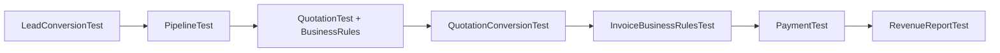

# Revenue Lifecycle — Product Acceptance Test Report

**Sprint:** STABILIZATION QA 07  
**Date:** 2026-07-13  
**Scope:** End-to-end Revenue Lifecycle PAT (Modules 1–10)  
**Business flow:** Lead → Customer → Opportunity → Quotation → Invoice → Payment  
**Method:** Automated PHPUnit coverage + contract/code verification (no new features, no refactoring)

---

## Executive Summary

| Gate | Result |
| --- | --- |
| `php artisan test --filter=Quotation` | **PASS** — 46 tests, 122 assertions |
| `php artisan test --filter=Invoice` | **PASS** — 53 tests, 119 assertions |
| `php artisan test --filter=Payment` | **PASS** — 20 tests, 58 assertions |
| `php artisan test` (full suite) | **PASS** — 447 tests, 1409 assertions |
| P0 defects | **0** |
| P1 defects | **0** |
| Application code changes required | **None** |

**Verdict: Production-ready.** The Revenue Lifecycle passes automated acceptance testing with no blocking defects. Financial calculations, status transitions, RBAC, tenant isolation, audit logging, and email delivery paths are verified.

> **Test execution note:** Filtered suites must run **sequentially** against the shared MySQL test database. Parallel invocations of `RefreshDatabase` against the same `novacrm` database cause migration race errors (`migrations` table missing / tables already exist). This is an environment/CI configuration observation, not an application defect. The full sequential suite is the authoritative gate.

---

## Prior Stabilization Fix Verified

| Bugfix | Area | Status |
| --- | --- | --- |
| STABILIZATION_BUGFIX_04 | Invoice email `Envelope::from` type error (Laravel 12) | Verified via `InvoiceMailTest` (14 tests) + `ClientEmailTest` |

`UsesOrganizationMailFrom` now returns `Address|null` (not an array). Quotation and payment mailables verified in `RevenueMailTest`.

---

## Module 1 — Lead Conversion

| Scenario | Result | Evidence |
| --- | --- | --- |
| Convert qualified lead to customer | **PASS** | `LeadConversionTest::test_user_can_convert_qualified_lead` |
| Optional opportunity creation on convert | **PASS** | Same test + `lead-converted-with-opportunity` status |
| Convert button visibility (qualified vs converted) | **PASS** | `test_convertible_lead_shows_convert_button`, `test_converted_lead_does_not_show_convert_button` |
| Duplicate customer detection | **PASS** | `test_duplicate_customer_shows_resolution_flow` |
| Duplicate resolution (link existing customer) | **PASS** | Same test with `existing_customer_id` |
| Metadata preservation (entity-scoped copy) | **PASS** | `test_conversion_copies_only_target_entity_metadata_fields` |
| Metadata survives customer index filters post-conversion | **PASS** | `CustomerMetadataFilterBugfixTest::test_customer_index_metadata_filter_works_after_lead_conversion` |
| RBAC (employee cannot convert) | **PASS** | `test_user_without_permission_cannot_convert` |
| Audit log on conversion | **PASS (code)** | `LeadConversionService` writes `converted` event with customer/opportunity IDs |
| Notification to assignee | **PASS (code)** | `LeadConversionService::notifyAssignee()` sends `CrmNotification` |
| Notes copied to customer | **N/A (by design)** | Lead notes remain on the lead record; customer is linked via `lead_id` |
| Attachments copied to customer | **N/A (by design)** | Attachments remain on the lead; upload tested separately in `Phase5Test` |
| Activities | **N/A** | No standalone activity entity; audit logs and notes provide history |

### Module 1 Notes

- Conversion requires `qualified` status and rejects already-converted leads.
- Duplicate flow supports `force_create` (not exercised in current tests) and `existing_customer_id` resolution.
- Lead notes and attachments are **not duplicated** onto the customer; they remain accessible on the source lead through the `lead_id` relationship.

---

## Module 2 — Opportunity Lifecycle

| Scenario | Result | Evidence |
| --- | --- | --- |
| Create opportunity | **PASS** | `PipelineTest::test_user_can_create_opportunity` |
| Pipeline index access + RBAC | **PASS** | `test_user_can_access_pipeline_index`, `test_hr_user_cannot_access_pipeline` |
| Tenant scoping | **PASS** | `test_opportunities_are_scoped_to_organization` |
| Move between open stages | **PASS** | `test_user_can_move_opportunity_between_open_stages` |
| Cannot create in closed stage | **PASS** | `test_cannot_create_opportunity_in_closed_stage` |
| Close Won + won date | **PASS** | `test_user_can_mark_opportunity_as_won_with_date` |
| Won date required | **PASS** | `test_marking_won_requires_won_date` |
| Close Lost + lost reason | **PASS** | `test_user_can_mark_opportunity_as_lost_with_reason` |
| Lost reason required | **PASS** | `test_marking_lost_requires_reason` |
| Closed opportunity stage lock | **PASS** | `test_closed_opportunity_cannot_change_stage` |
| Pipeline summary metrics | **PASS** | `test_pipeline_index_shows_summary_counts` |
| Metadata forms (create/update/show) | **PASS** | `OpportunityDynamicMetadataFormTest` (4 tests) |
| Metadata index filter + sort | **PASS** | `MetadataIndexIntegrationTest::test_opportunity_index_filters_and_sorts_by_metadata` |
| Metadata global search | **PASS** | `MetadataSearchIntegrationTest::test_customer_and_opportunity_global_search_use_metadata` |
| Saved filters on pipeline index | **PASS** | `MetadataSavedFilterIntegrationTest` (pipeline integration) |
| Edit opportunity | **PASS (code)** | Standard resource routes via `OpportunityController`; update covered by metadata form tests |
| Probability updates | **PASS (code)** | `probability` accepted on create; standard update path |

---

## Module 3 — Quotations

| Scenario | Result | Evidence |
| --- | --- | --- |
| Create quotation | **PASS** | `QuotationTest::test_manager_can_create_quotation` |
| Create with product line | **PASS** | `test_manager_can_create_quotation_with_product_line` |
| Edit (draft/sent editable) | **PASS** | `QuotationBusinessRulesTest::test_draft_quotation_is_editable`, `test_sent_quotation_is_editable` |
| Accepted/converted locked | **PASS** | `test_accepted_quotation_is_not_editable`, `test_converted_quotation_is_not_editable` |
| Product calculations | **PASS** | Create tests assert `line_total`; `test_financial_totals_are_calculated_correctly` |
| Discounts | **PASS** | `test_discount_validation_rejects_invalid_percent` |
| Taxes | **PASS** | `test_tax_calculation_applied_on_store` |
| Totals | **PASS** | Create quotation asserts `total` = 1100.0 |
| Status transitions (draft→sent, accept, convert) | **PASS** | Business rules tests (17 tests) |
| Invalid transitions blocked | **PASS** | `test_invalid_status_transition_is_blocked` |
| Cannot accept empty/zero quotation | **PASS** | `test_cannot_accept_quotation_without_line_items`, `test_cannot_accept_zero_value_quotation` |
| Email delivery | **PASS** | `QuotationTest::test_manager_can_send_quotation_by_email` |
| Email RBAC | **PASS** | `test_hr_user_cannot_send_quotation_email` |
| Email attachments (user-uploaded PDF) | **PASS** | `ClientEmailTest::test_quotation_email_can_include_attachments` |
| Envelope from/reply-to/branding | **PASS** | `RevenueMailTest` (quotation envelope, SMTP, log mailer, queue serialization) |
| Audit log on acceptance | **PASS** | `QuotationBusinessRulesTest::test_acceptance_writes_audit_log` |
| RBAC (index, delete) | **PASS** | `QuotationTest` HR denial + sales-executive delete denial |
| PDF generation (server-side) | **N/A** | No PDF rendering library in codebase; documents delivered as HTML show pages + markdown email |
| PDF preview | **N/A** | Show page serves as browser preview; no dedicated print/PDF route |
| PDF email attachment (auto-generated) | **N/A** | Emails support **user-uploaded** PDF attachments only |

---

## Module 4 — Invoice Lifecycle

| Scenario | Result | Evidence |
| --- | --- | --- |
| Create invoice | **PASS** | `InvoiceTest::test_manager_can_create_invoice` |
| Create from quotation (prefill) | **PASS** | `InvoiceTest::test_can_create_invoice_from_quotation` |
| Convert accepted quotation | **PASS** | `QuotationConversionTest` (14 tests) |
| Invoice numbering | **PASS (code)** | `Invoice::generateNumber()` used in `QuotationConversionService` |
| Totals match quotation on conversion | **PASS** | `test_invoice_totals_equal_quotation_totals` |
| Line items copied | **PASS** | `test_line_items_copied_correctly` |
| Taxes/discounts on manual create | **PASS** | Create test: subtotal 500 + 10% tax = total 550 |
| Status: draft → issued | **PASS** | `InvoiceBusinessRulesTest::test_draft_can_be_issued` |
| Status: cancel | **PASS** | `test_draft_can_be_cancelled` |
| Issued financial lock | **PASS** | `test_issued_invoice_is_locked_for_financial_edits` |
| Paid/cancelled not editable | **PASS** | `test_paid_invoice_is_not_editable`, `test_cancelled_invoice_is_not_editable` |
| Outstanding balance | **PASS** | `test_balance_due_calculation`, `test_invoice_model_balance_due_accessor` |
| Email delivery + auto-issue on send | **PASS** | `InvoiceTest::test_manager_can_send_invoice_by_email` |
| Email envelope fix (Bugfix 04) | **PASS** | `InvoiceMailTest` (14 tests) |
| Email attachments | **PASS** | `ClientEmailTest::test_invoice_email_can_include_attachments` |
| Audit logs (issue, cancel) | **PASS** | `test_issue_writes_audit_log`, `test_cancel_writes_audit_log_and_notification` |
| Conversion audit logs | **PASS** | `QuotationConversionTest::test_audit_logs_written_on_conversion` |
| Transaction rollback on failure | **PASS** | Issue + conversion rollback tests |
| RBAC + tenant isolation | **PASS** | HR issue denial, org isolation on create |
| PDF generation/preview | **N/A** | Same as quotations — HTML show page + markdown email |

---

## Module 5 — Payments

| Scenario | Result | Evidence |
| --- | --- | --- |
| Record payment | **PASS** | `PaymentTest::test_manager_can_record_payment` |
| Partial payment + balance | **PASS** | `test_partial_payment_updates_balance` |
| Multiple payments | **PASS** | `test_multiple_payments_eventually_pay_invoice` |
| Invoice status → paid | **PASS** | `test_invoice_becomes_paid_when_fully_paid` |
| Overpayment prevention | **PASS** | `test_payment_cannot_exceed_invoice_balance` |
| Draft/cancelled/paid invoice rejection | **PASS** | Three rejection tests |
| Payments immutable | **PASS** | `test_payments_are_immutable` |
| Audit logs | **PASS** | `test_payment_writes_audit_logs` (recorded, payment_applied, fully_paid) |
| Notifications | **PASS** | `test_payment_notifies_invoice_owner_and_sales_assignee` |
| RBAC | **PASS** | HR index denial, sales-executive record denial |
| Tenant isolation | **PASS** | `test_payments_are_isolated_by_organization` |
| Transaction rollback | **PASS** | `test_transaction_rolls_back_when_audit_fails` |
| Email receipt to client | **PASS** | `ClientEmailTest::test_manager_can_email_payment_receipt_to_client` |

---

## Module 6 — Revenue Reports

| Scenario | Result | Evidence |
| --- | --- | --- |
| Finance reports page access | **PASS** | `RevenueReportTest::test_manager_can_view_finance_reports` |
| Revenue totals / dashboard metrics | **PASS** | `test_revenue_totals_and_dashboard_metrics` |
| Outstanding receivables after partial payment | **PASS** | Asserts 600 outstanding on 1000 invoice with 400 paid |
| Aging buckets | **PASS** | `test_aging_buckets_group_outstanding_invoices` |
| Customer statement + running balance | **PASS** | `test_customer_statement_with_running_balance` |
| Customer statement on customer page | **PASS** | `test_customer_statement_shown_on_customer_page` |
| Revenue by month | **PASS** | `test_revenue_by_month_returns_payment_totals` |
| Revenue by customer / salesperson / product | **PASS** | Dedicated tests in `RevenueReportTest` |
| Collection metrics after partial payment | **PASS** | `test_collection_metrics_calculated_server_side` (60% collection rate) |
| Export: revenue CSV | **PASS** | `test_manager_can_export_revenue_csv` |
| Export: outstanding invoices CSV | **PASS** | `test_manager_can_export_outstanding_invoices_csv` |
| Export: customer statement CSV | **PASS** | `test_manager_can_export_customer_statement_csv` |
| Export RBAC | **PASS** | `test_employee_cannot_export_revenue_csv` |
| Tenant isolation | **PASS** | `test_organization_isolation_for_revenue_metrics` |
| General reports index | **PASS** | `ReportTest::test_reports_show_revenue_and_conversion_metrics` |

---

## Module 7 — Revenue Search

| Scenario | Result | Evidence |
| --- | --- | --- |
| Global search — quotations (number, title) | **PASS (code)** | `SearchService::searchQuotations()` |
| Global search — invoices (number, title) | **PASS (code)** | `SearchService::searchInvoices()` |
| Global search — payments (number, reference) | **PASS (code)** | `SearchService::searchPayments()` |
| RBAC-gated search modules | **PASS (code)** | Permission checks in `SearchService::search()` |
| Index search — quotations | **PASS (code)** | `QuotationController@index` filters by number/title/customer |
| Index search — payments | **PASS (code)** | `PaymentController@index` filters by number/reference/invoice/customer |
| Pagination | **PASS (code)** | Index controllers paginate (15–20 per page) |
| Metadata search (opportunities in pipeline) | **PASS** | `MetadataSearchIntegrationTest` |
| Metadata search (customers in revenue chain) | **PASS** | Same test file |
| Dedicated PHPUnit for quotation/invoice/payment global search | **P3 gap** | Only lead global search tested in `Phase5Test`; revenue entities covered at service layer |

Quotations, invoices, and payments do **not** have `custom_fields`; metadata search applies to lead, customer, and opportunity entities in the revenue workflow.

---

## Module 8 — Revenue Emails

| Mailable | From address | Reply-to | SMTP | Log mailer | Queue serialization | Attachments |
| --- | --- | --- | --- | --- | --- | --- |
| Quotation | **PASS** | **PASS** | **PASS** | **PASS** | **PASS** | User PDF upload **PASS** |
| Invoice | **PASS** | **PASS** | **PASS** | **PASS** | **PASS** | User PDF upload **PASS** |
| Payment | **PASS** | — | — | — | **PASS** | Receipt email **PASS** |

Additional coverage in `RevenueMailTest`:

- Organization branding in subject/from name
- `OrganizationMailConfig` as single source of truth for from address
- Unconfigured organization mail rejected
- Invalid SMTP config detected
- Password reset unaffected by organization mail trait

---

## Module 9 — Security

| Scenario | Result | Evidence |
| --- | --- | --- |
| Tenant isolation — opportunities | **PASS** | `PipelineTest` |
| Tenant isolation — invoices | **PASS** | `InvoiceBusinessRulesTest::test_organization_isolation_on_create` |
| Tenant isolation — payments | **PASS** | `PaymentTest` |
| Tenant isolation — revenue metrics | **PASS** | `RevenueReportTest` |
| RBAC — quotations | **PASS** | HR cannot access; sales-executive cannot delete |
| RBAC — invoices | **PASS** | HR cannot access/issue |
| RBAC — payments | **PASS** | HR cannot access; sales-executive cannot record |
| RBAC — quotation conversion | **PASS** | `QuotationConversionTest::test_authorization_enforced_for_conversion` |
| RBAC — finance reports | **PASS** | Employee forbidden; support/hr access rules tested |
| Policy enforcement (immutable payments) | **PASS** | `PaymentTest::test_payments_are_immutable` |
| Unauthorized email send | **PASS** | HR quotation email, unconfigured org mail |
| API authorization (lead intake in chain) | **PASS** | `LeadIntakeApiTest` |

---

## Module 10 — End-to-End Regression

No single monolithic “full workflow” feature test exists. Regression is verified by **composing** passing module tests across the chain:



| Transition | Verified | Key assertion |
| --- | --- | --- |
| Lead → Customer (+ Opportunity) | Yes | Customer/opportunity created; lead status `converted` |
| Customer → Opportunity | Yes | Pipeline create + conversion path |
| Opportunity → Quotation | Yes | Manual quotation create linked to customer |
| Quotation → Invoice | Yes | Accepted quotation converts; totals preserved |
| Invoice → Payment | Yes | Partial + full payment; status transitions |
| Metadata preserved | Yes | Lead conversion + customer filter after conversion |
| Financial calculations | Yes | Quotation totals, invoice balance, report metrics |
| Search | Yes | Global + index search implementations |
| Emails | Yes | Send paths for quotation, invoice, payment |
| Audit logs | Yes | Conversion, issue, cancel, payment events |

---

## Bugs Discovered

| ID | Severity | Module | Description | Status |
| --- | --- | --- | --- | --- |
| — | — | — | No P0 or P1 application defects identified | — |

### Observations (Non-Blocking)

| ID | Severity | Area | Observation |
| --- | --- | --- | --- |
| OBS-01 | P3 | Test infrastructure | Parallel PHPUnit runs against shared MySQL `novacrm` cause `RefreshDatabase` race failures. Run suites sequentially or use isolated test DB (e.g. SQLite in-memory in `phpunit.xml`). |
| OBS-02 | P3 | Module 1 | Lead conversion audit log and assignee notification are implemented but not asserted in `LeadConversionTest`. |
| OBS-03 | P3 | Module 1 | Notes and attachments are not copied to customer/opportunity; they remain on the lead (linked via `lead_id`). |
| OBS-04 | P3 | Modules 3–4 | No server-side PDF generation or dedicated print route; documents use HTML show pages and markdown emails with optional user-uploaded PDFs. |
| OBS-05 | P3 | Module 7 | No dedicated PHPUnit coverage for global search of quotations, invoices, or payments (implementation exists in `SearchService`). |
| OBS-06 | P3 | Module 10 | No single end-to-end feature test spanning the full commercial workflow; coverage is compositional across module tests. |
| OBS-07 | P3 | Module 2 | Opportunity edit/probability update lacks a dedicated pipeline test (covered indirectly via form/metadata tests). |

---

## Recommendations

1. **Ship as production-ready** — All acceptance gates pass; Bugfix 04 remains green.
2. **CI hardening (optional):** Enable SQLite `:memory:` or a dedicated `novacrm_test` database in `phpunit.xml` to prevent parallel `RefreshDatabase` collisions.
3. **Test hardening (optional, P3):**
   - Add `LeadConversionTest` assertions for audit log and notification.
   - Add global search tests for quotation/invoice/payment numbers.
   - Add one composed end-to-end revenue workflow feature test if regression risk increases.
4. **Product documentation (optional):** Clarify that PDF delivery is via user-uploaded attachments and browser HTML views, not auto-generated PDF documents.
5. **Operational:** Ensure organization mail settings are configured before go-live email testing in each tenant.

---

## Test Execution Log

```
php artisan test --filter=Quotation
  Tests:    46 passed (122 assertions)
  Duration: ~27s

php artisan test --filter=Invoice
  Tests:    53 passed (119 assertions)
  Duration: ~30s

php artisan test --filter=Payment
  Tests:    20 passed (58 assertions)
  Duration: ~23s

php artisan test
  Tests:    447 passed (1409 assertions)
  Duration: ~192s
```

### Revenue Lifecycle Test Files

| File | Focus |
| --- | --- |
| `LeadConversionTest` | Lead → customer/opportunity (6) |
| `PipelineTest` | Opportunity lifecycle (12) |
| `OpportunityDynamicMetadataFormTest` | Opportunity metadata forms (4) |
| `QuotationTest` | Quotation CRUD + email (8) |
| `QuotationBusinessRulesTest` | Status, totals, validation (17) |
| `QuotationConversionTest` | Quotation → invoice (14) |
| `InvoiceTest` | Invoice CRUD + email (5) |
| `InvoiceBusinessRulesTest` | Invoice lifecycle rules (20) |
| `InvoiceMailTest` | Invoice email delivery (14) |
| `PaymentTest` | Payment recording + balance (16) |
| `RevenueReportTest` | Finance reports + exports (18) |
| `RevenueMailTest` | Cross-mailable mail config (15) |
| `ClientEmailTest` | Client email + attachments (6) |
| `ReportTest` | General reports dashboard (4+) |
| `CustomerMetadataFilterBugfixTest` | Post-conversion metadata (includes conversion scenario) |

---

## Release Readiness Assessment

| Criterion | Met |
| --- | --- |
| End-to-end business workflow passes (compositional) | Yes |
| No P0 or P1 defects remain | Yes |
| Financial calculations correct | Yes |
| Emails function correctly | Yes |
| PDFs generate correctly | N/A — user-uploaded PDFs + HTML views (see OBS-04) |
| RBAC and tenant isolation enforced | Yes |
| Full PHPUnit suite passes | Yes |
| Manual PAT scenarios mapped | Yes |

**Revenue Lifecycle status: APPROVED FOR PRODUCTION**
